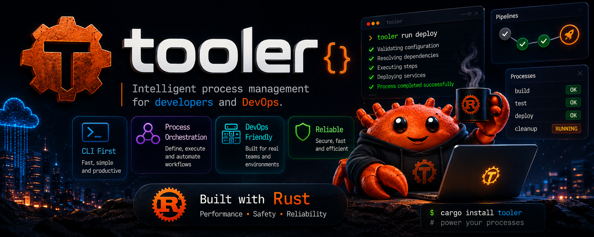

# tooler

> Intelligent process management for **developers** and **DevOps** teams. Built with Rust — fast, portable, no runtime required.

## Table of Contents

- [Installation](#installation)
- [Output formats](#output-formats)
- [Commands](#commands)
  - [tooler info](#tooler-info)
  - [tooler env](#tooler-env)
  - [tooler http](#tooler-http)
  - [tooler check](#tooler-check)
  - [tooler json](#tooler-json)
  - [tooler run](#tooler-run)
  - [tooler play](#tooler-play)
  - [tooler git](#tooler-git)
  - [tooler scaffold](#tooler-scaffold)
  - [tooler config](#tooler-config)
  - [tooler completions](#tooler-completions)
- [Extending tooler](#extending-tooler)
- [Releasing a new version](#releasing-a-new-version)
- [Dependencies](#dependencies)

---

## Installation

### Option 1 — curl (no Rust required)

Downloads a prebuilt binary for your OS and architecture:

```sh
curl -fsSL https://raw.githubusercontent.com/venturaproject/tooler/master/install.sh | sh
```

Supports: macOS (Intel + Apple Silicon), Linux (x86\_64 + arm64).

To install a specific version:

```sh
TOOLER_VERSION=v1.0.0 curl -fsSL https://raw.githubusercontent.com/venturaproject/tooler/master/install.sh | sh
```

### Option 2 — cargo (requires Rust)

```sh
cargo install --git https://github.com/venturaproject/tooler
```

Or from a local clone:

```sh
git clone https://github.com/venturaproject/tooler
cd tooler
cargo install --path .
```

### Install Rust (only needed for Option 2)

```sh
curl --proto '=https' --tlsv1.2 -sSf https://sh.rustup.rs | sh
source "$HOME/.cargo/env"
```

### Requirements

| Method | Requirement |
|---|---|
| curl install | nothing — binary is self-contained |
| cargo install | Rust 1.70+ and Cargo |
| Build from source | Rust 1.70+ and Cargo |

Supported platforms: macOS, Linux, Windows (Windows via cargo only).

### Verify

```sh
tooler --version
```

If the command is not found, add the install directory to your PATH:

```sh
export PATH="$HOME/.local/bin:$PATH"   # curl install
export PATH="$HOME/.cargo/bin:$PATH"   # cargo install
```

### Uninstall

```sh
sudo rm /usr/local/bin/tooler   # curl install
cargo uninstall tooler           # cargo install
```

---

## Output formats

Every command accepts a global `--output` flag:

```sh
tooler <command> --output plain   # default: human-readable with colors
tooler <command> --output json    # machine-readable JSON
tooler <command> --output table   # aligned columns
```

You can set a default in your config so you never have to pass it:

```sh
tooler config set default.output json
```

---

## Commands

### tooler info

Show system information: working directory and environment variables.

```sh
tooler info              # show everything
tooler info --dir        # working directory only
tooler info --env        # environment variables only
tooler info --output json
```

---

### tooler env

Manage `.env` files — inspect, compare and validate them.

```sh
tooler env show .env                      # show vars (values masked)
tooler env show .env --reveal             # show real values
tooler env show .env --output json        # JSON output
tooler env list .env                      # list keys only
tooler env get DATABASE_URL .env          # get a single value
tooler env diff .env .env.example         # keys present in one but not the other
tooler env check .env.example .env        # verify .env has all keys from .env.example
```

---

### tooler http

Make HTTP requests with optional profile-based auth.

```sh
tooler http get https://api.example.com/users
tooler http get /users --profile staging          # uses profile base_url
tooler http get /health --token abc123            # Bearer auth
tooler http get /users --header "X-Key: value"
tooler http post /users --body '{"name":"test"}'
tooler http post /users --body '{"name":"test"}' --timeout 30
```

Set a profile base URL and token once, use everywhere:

```sh
tooler config set profile.staging.base_url https://staging.example.com
tooler config set profile.staging.token mytoken123
tooler http get /users --profile staging
```

---

### tooler check

Health-check URLs and TCP ports.

```sh
tooler check url https://api.example.com/health
tooler check url https://api.example.com/health --timeout 10
tooler check port localhost 5432          # PostgreSQL
tooler check port localhost 6379          # Redis
tooler check port redis.internal 6379 --timeout 5
```

Exit code is non-zero on failure — works well in scripts and CI.

---

### tooler json

Pretty-print and query JSON from a file or stdin.

```sh
tooler json file.json                     # pretty-print
tooler json file.json --key user.name     # extract nested field
tooler json file.json --compact           # compact output
cat file.json | tooler json               # read from stdin
cat file.json | tooler json --key items
```

---

### tooler run

Run named scripts defined in a `.tooler.toml` file at the project root.

**`.tooler.toml`**:

```toml
[scripts]
dev     = "npm run dev"
test    = "cargo test"
lint    = "cargo clippy -- -D warnings"
build   = "cargo build --release"
deploy  = "sh scripts/deploy.sh staging"
ci      = "cargo fmt --check && cargo clippy -- -D warnings && cargo test"
```

```sh
tooler run               # list available scripts
tooler run build         # execute a script
tooler run test --dry    # preview without running
tooler run test -- --nocapture   # pass extra args to the script
```

Tooler walks up the directory tree to find `.tooler.toml`, so it works from any subdirectory of the project.

---

### tooler play

Run YAML playbooks — define tasks, variables and health checks in a single file. Similar to Ansible but lightweight and self-contained.

**`playbook.yml`**:

```yaml
name: Deploy staging
description: Build, verify and deploy

vars:
  host: staging.example.com
  port: "8080"

tasks:
  - name: Check env file is complete
    env_check:
      reference: .env.example
      target: .env

  - name: Build release binary
    run: cargo build --release
    tags: [build]

  - name: Run tests
    run: cargo test
    tags: [test]
    ignore_errors: true

  - name: Health check
    check_url: http://{{host}}:{{port}}/health
    tags: [deploy]

  - name: Verify database port
    check_port:
      host: "{{host}}"
      port: 5432
      timeout: 3
    tags: [deploy]
```

```sh
tooler play --init                          # generate a sample playbook.yml
tooler play playbook.yml                    # run all tasks
tooler play playbook.yml --dry              # preview without executing
tooler play playbook.yml --tags build,test  # run only tagged tasks
tooler play playbook.yml --var host=prod.example.com   # override a variable
```

**Available task actions:**

| Action | Description |
|---|---|
| `run: <cmd>` | Execute a shell command |
| `check_url: <url>` | HTTP health check (expects 2xx) |
| `check_port: {host, port}` | TCP connectivity check |
| `env_check: {reference, target}` | Verify .env has all keys from reference |

Commands and file paths in tasks always resolve **relative to the playbook file's directory**, not where you run `tooler play` from.

---

### tooler git

Git utilities for day-to-day team workflows.

```sh
tooler git summary                    # branch, tag, ahead/behind, status, recent commits
tooler git clean                      # preview merged branches to delete
tooler git clean --confirm            # delete merged branches
tooler git clean --confirm --remote   # also delete from origin
tooler git changelog                  # commits since last tag, grouped by feat/fix/other
tooler git changelog --from v1.0.0    # changelog from a specific tag
```

---

### tooler scaffold

Generate new projects from built-in templates.

```sh
tooler scaffold list                            # list available templates
tooler scaffold new rust-cli my-tool            # create ./my-tool/
tooler scaffold new node-api backend            # create ./backend/
tooler scaffold new python-cli my-script        # create ./my-script/
tooler scaffold new rust-cli my-tool --dir /custom/path
```

**Built-in templates:**

| Template | Description |
|---|---|
| `rust-cli` | Rust CLI with clap and anyhow |
| `node-api` | Node.js REST API with Express |
| `python-cli` | Python CLI with argparse |

Templates substitute `{{name}}`, `{{name_snake}}`, `{{author}}` and `{{year}}` automatically.

---

### tooler config

Manage tooler's configuration stored at `~/.tooler/config.toml`.

```sh
tooler config show                          # show full config
tooler config path                          # show config file location
tooler config get default.output            # read a value
tooler config set default.output json       # set a value (plain | json | table)
tooler config set default.color false
tooler config profiles                      # list configured profiles
```

**Config file structure** (`~/.tooler/config.toml`):

```toml
[default]
output = "plain"
color = true

[profile.staging]
base_url = "https://staging.example.com"
token = "mytoken"

[profile.prod]
base_url = "https://example.com"
token = "prodtoken"
```

---

### tooler completions

Generate shell completion scripts.

```sh
tooler completions zsh  >> ~/.zshrc
tooler completions bash >> ~/.bashrc
tooler completions fish  > ~/.config/fish/completions/tooler.fish
```

---

## Extending tooler

Adding a new command takes five steps:

**1.** Create `src/commands/my_command.rs`:

```rust
use anyhow::Result;
use clap::Args;
use crate::context::Context;

#[derive(Args)]
pub struct MyCommandArgs {
    pub input: String,
}

pub fn run(args: MyCommandArgs, _ctx: &Context) -> Result<()> {
    println!("input: {}", args.input);
    Ok(())
}
```

**2.** Register in `src/commands/mod.rs`:

```rust
pub mod my_command;
```

**3.** Add to `Commands` in `src/cli.rs`:

```rust
/// Description shown in --help
MyCommand(my_command::MyCommandArgs),
```

**4.** Handle in `src/main.rs`:

```rust
Commands::MyCommand(args) => commands::my_command::run(args, &ctx),
```

**5.** Reinstall:

```sh
cargo install --path .
```

---

## Releasing a new version

Tag a commit — GitHub Actions builds binaries for all platforms automatically:

```sh
git tag v1.1.0
git push origin v1.1.0
```

Builds for: `linux/x86_64`, `linux/aarch64`, `macos/x86_64`, `macos/aarch64`, `windows/x86_64`.

---

## Dependencies

| Crate | Purpose |
|---|---|
| `clap` | Argument parsing and subcommand structure |
| `anyhow` + `thiserror` | Error handling |
| `colored` | Terminal color output |
| `serde` + `serde_json` | JSON serialization |
| `serde_yaml` | YAML playbook parsing |
| `toml` | Config file parsing |
| `reqwest` | HTTP client (http, check, play) |
| `dirs` | Home directory resolution |
| `chrono` | Date/year for scaffold templates |
| `clap_complete` | Shell completion generation |
