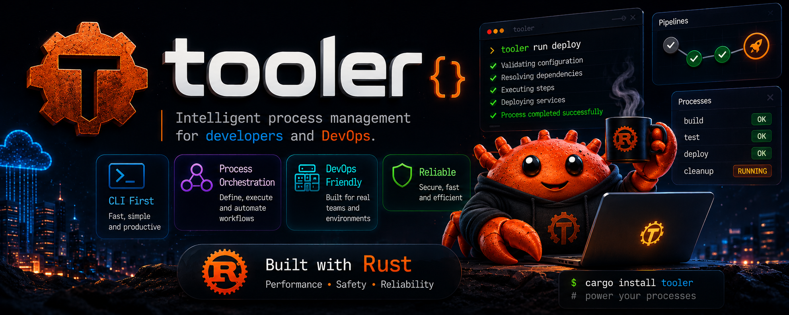

# tooler

> Intelligent process management for **developers** and **DevOps** teams. Built with Rust — fast, portable, no runtime required.

## Table of Contents

- [Installation](#installation)
- [Output formats](#output-formats)
- [Commands](#commands)
  - [tooler info](#tooler-info)
  - [tooler env](#tooler-env)
  - [tooler http](#tooler-http)
  - [tooler jobs](#tooler-jobs)
  - [tooler check](#tooler-check)
  - [tooler json](#tooler-json)
  - [tooler run](#tooler-run)
  - [tooler play](#tooler-play)
  - [tooler git](#tooler-git)
  - [tooler scaffold](#tooler-scaffold)
  - [tooler config](#tooler-config)
  - [tooler completions](#tooler-completions)
  - [tooler doctor](#tooler-doctor)
  - [tooler report](#tooler-report)
  - [tooler db](#tooler-db)
  - [tooler mail](#tooler-mail)
  - [tooler vault](#tooler-vault)
  - [tooler gh](#tooler-gh)
  - [tooler systemd](#tooler-systemd)
  - [tooler cron](#tooler-cron)
  - [tooler logs](#tooler-logs)
  - [tooler ps](#tooler-ps)
  - [tooler fs](#tooler-fs)
  - [tooler deploy](#tooler-deploy)
  - [tooler fleet](#tooler-fleet)
  - [tooler group](#tooler-group)
  - [tooler stat](#tooler-stat)
  - [tooler mcp](#tooler-mcp)
- [Extending tooler](#extending-tooler)
- [Releasing a new version](#releasing-a-new-version)
- [Dependencies](#dependencies)
- [License](#license)

---

## Installation

### Option 1 — curl (no Rust required)

Downloads a prebuilt binary for your OS and architecture:

```sh
curl -fsSL https://raw.githubusercontent.com/venturaproject/tooler/main/install.sh | sh
```

Supports: macOS (Intel + Apple Silicon), Linux (x86\_64 + arm64).

To install a specific version:

```sh
TOOLER_VERSION=v1.0.0 curl -fsSL https://raw.githubusercontent.com/venturaproject/tooler/main/install.sh | sh
```

### Option 2 — cargo (requires Rust)

```sh
cargo install --git https://github.com/venturaproject/tooler
```

Or from a local clone:

```sh
git clone https://github.com/venturaproject/tooler
cd tooler
cargo install --path .
```

### Install Rust (only needed for Option 2)

```sh
curl --proto '=https' --tlsv1.2 -sSf https://sh.rustup.rs | sh
source "$HOME/.cargo/env"
```

### Requirements

| Method | Requirement |
|---|---|
| curl install | nothing — binary is self-contained |
| cargo install | Rust 1.70+ and Cargo |
| Build from source | Rust 1.70+ and Cargo |

Supported platforms: macOS, Linux, Windows (Windows via cargo only).

### Verify

```sh
tooler --version
```

If the command is not found, add the install directory to your PATH:

```sh
export PATH="$HOME/.local/bin:$PATH"   # curl install
export PATH="$HOME/.cargo/bin:$PATH"   # cargo install
```

### Uninstall

```sh
sudo rm /usr/local/bin/tooler   # curl install
cargo uninstall tooler           # cargo install
```

---

## Output formats

Every command accepts a global `--output` flag:

```sh
tooler <command> --output plain   # default: human-readable with colors
tooler <command> --output json    # machine-readable JSON
tooler <command> --output table   # aligned columns
```

You can set a default in your config so you never have to pass it:

```sh
tooler config set default.output json
```

---

## Commands

### tooler info

Show system information: working directory and environment variables.

```sh
tooler info              # show everything
tooler info --dir        # working directory only
tooler info --env        # environment variables only
tooler info --output json
```

---

### tooler env

Manage `.env` files — inspect, compare and validate them.

```sh
tooler env show .env                      # show vars (values masked)
tooler env show .env --reveal             # show real values
tooler env show .env --output json        # JSON output
tooler env list .env                      # list keys only
tooler env get DATABASE_URL .env          # get a single value
tooler env diff .env .env.example         # keys present in one but not the other
tooler env check .env.example .env        # verify .env has all keys from .env.example
```

---

### tooler http

Make HTTP requests with optional profile-based auth.

```sh
tooler http get https://api.example.com/users
tooler http get /users --profile staging          # uses profile base_url
tooler http get /health --token abc123            # Bearer auth (or set TOOLER_HTTP_TOKEN)
tooler http get /users --header "X-Key: value"
tooler http post /users --body '{"name":"test"}'
tooler http post /users --body '{"name":"test"}' --timeout 30
```

Set a profile base URL and token once, use everywhere:

```sh
tooler config set profile.staging.base_url https://staging.example.com
tooler config set profile.staging.token mytoken123
tooler http get /users --profile staging
```

Tokens are never written to `config.toml` in plaintext — they're stored encrypted in the OS credential store (Keychain on macOS, Credential Manager on Windows, Secret Service on Linux). `tooler config show` / `config profiles` never reveal the value, only whether a token is set (`[token]`). Remove one with `tooler config unset profile.staging.token`.

A profile's stored token is only ever attached automatically when the request's URL has the same scheme+host+port as that profile's `base_url` — a relative path (which is always resolved against `base_url`) or an absolute URL that happens to match it. A request to any other host (e.g. one an MCP tool caller supplies) is sent without it; pass `--token` explicitly if you really want to send a credential somewhere else.

#### OAuth2 profiles (refresh-token grant)

For APIs that require OAuth2 instead of a static bearer token (e.g. Exact Online/Exact Synergy, and most REST ERP APIs), configure a profile with a `token_url` instead of (or in addition to) a static `token`. Once `token_url` is set, `tooler http` automatically exchanges the stored `refresh_token` for a short-lived access token, caches it until shortly before it expires, and transparently refreshes it again as needed — no static token to keep in sync.

```sh
tooler config set profile.exact.base_url https://start.exactonline.nl/api/v1/<division>
tooler config set profile.exact.token_url https://start.exactonline.nl/api/oauth2/token
tooler config set profile.exact.client_id <client_id>
tooler config set profile.exact.client_secret <client_secret>
tooler config set profile.exact.refresh_token <initial_refresh_token>
tooler http get /crm/Accounts --profile exact
```

`tooler` does **not** perform the initial interactive OAuth2 login. Obtaining that first `client_id`/`client_secret`/`refresh_token` triple is a one-time step you do yourself against the provider (register an app, complete the authorization-code login in a browser) — from then on, `tooler` handles every refresh automatically, including providers like Exact that rotate the refresh token on every use (the newly issued one silently replaces the stored one).

Like `token`, `client_secret` and `refresh_token` are stored only in the OS credential store, never in `config.toml`. The cached access token and its expiry live there too. `tooler config profiles` marks OAuth2-managed profiles with `[oauth2]`.

---

### tooler jobs

Search job listings via [Adzuna](https://developer.adzuna.com/) (free API, instant self-serve key). Defaults to `desarrollador` roles in Madrid, Spain — Spanish keywords match Spain listings noticeably better than their English translations (e.g. `desarrollador` over `developer`).

```sh
tooler jobs configure --app-id <id> --app-key <key>     # one-time, stores in the OS keychain
tooler jobs categories                                   # list valid --category tags for Spain
tooler jobs search                                       # desarrollador jobs in Madrid (defaults)
tooler jobs search --what "desarrollador java" --where barcelona
tooler jobs search --category it-jobs --where madrid     # filter by sector, not just keyword
tooler jobs search --salary-min 40000 --exclude java      # minimum salary, exclude a keyword
tooler jobs search --max-days-old 3 --title-only           # posted in the last 3 days, precise title match
tooler jobs search --what developer --country gb --where london --results 10
```

| Command | Description |
|---|---|
| `search` | Search listings — `--what`, `--where`, `--country`, `--category`, `--exclude`, `--salary-min`, `--max-days-old`, `--sort-by`, `--title-only`, `--page`, `--results` |
| `categories` | List valid `--category` tags for a country (`--country`) |
| `configure` | Store `--app-id`/`--app-key` in the OS keychain for the active profile |

`--category` filters by sector using Adzuna's own taxonomy (e.g. `it-jobs`, `engineering-jobs`) rather than relying on keyword matching alone — run `tooler jobs categories` to see the exact tags available for a country. `--title-only` matches `--what` against just the job title instead of the full description, for a more precise (if narrower) match.

`--sort-by date` trades relevance for recency — Adzuna's own ranking, not `tooler`'s: combined with other filters it can surface listings that only loosely match `--what`, since it de-prioritizes the relevance signal that keyword matching relies on. Leave `--sort-by` unset (the default) when result relevance matters more than freshness.

Credentials are resolved in this order: `--app-id`/`--app-key` flags → `TOOLER_ADZUNA_APP_ID`/`TOOLER_ADZUNA_APP_KEY` env vars → the OS keychain (set via `configure`). `tooler jobs configure` is CLI-only — it's deliberately not exposed as an MCP tool, since an agent storing a credential through a tool call would mean the credential passes through the LLM's context.

---

### tooler check

Health-check URLs and TCP ports.

```sh
tooler check url https://api.example.com/health
tooler check url https://api.example.com/health --timeout 10
tooler check port localhost 5432          # PostgreSQL
tooler check port localhost 6379          # Redis
tooler check port redis.internal 6379 --timeout 5
```

Exit code is non-zero on failure — works well in scripts and CI.

---

### tooler json

Pretty-print and query JSON from a file or stdin.

```sh
tooler json file.json                     # pretty-print
tooler json file.json --key user.name     # extract nested field
tooler json file.json --compact           # compact output
cat file.json | tooler json               # read from stdin
cat file.json | tooler json --key items
```

---

### tooler run

Run named scripts defined in a `.tooler.toml` file at the project root.

**`.tooler.toml`**:

```toml
[scripts]
dev     = "npm run dev"
test    = "cargo test"
lint    = "cargo clippy -- -D warnings"
build   = "cargo build --release"
deploy  = "sh scripts/deploy.sh staging"
ci      = "cargo fmt --check && cargo clippy -- -D warnings && cargo test"
```

```sh
tooler run               # list available scripts
tooler run build         # execute a script
tooler run test --dry    # preview without running
tooler run test -- --nocapture   # pass extra args to the script
```

Tooler walks up the directory tree to find `.tooler.toml`, so it works from any subdirectory of the project.

---

### tooler play

Run YAML playbooks — define tasks, variables and health checks in a single file. Similar to Ansible but lightweight and self-contained.

**`playbook.yml`**:

```yaml
name: Deploy staging
description: Build, verify and deploy

vars:
  host: staging.example.com
  port: "8080"

tasks:
  - name: Check env file is complete
    env_check:
      reference: .env.example
      target: .env

  - name: Build release binary
    run: cargo build --release
    tags: [build]

  - name: Run tests
    run: cargo test
    tags: [test]
    ignore_errors: true

  - name: Health check
    check_url: http://{{host}}:{{port}}/health
    tags: [deploy]

  - name: Verify database port
    check_port:
      host: "{{host}}"
      port: 5432
      timeout: 3
    tags: [deploy]
```

```sh
tooler play --init                          # generate playbooks/playbook.yml
tooler play playbook.yml                    # run all tasks
tooler play playbook.yml --dry              # preview without executing
tooler play playbook.yml --tags build,test  # run only tagged tasks
tooler play playbook.yml --skip-tags deploy # run everything except tagged tasks
tooler play playbook.yml --list-tasks       # inspect the task tree, run nothing
tooler play playbook.yml --list-tags        # list every tag used, run nothing
tooler play playbook.yml --lint             # static analysis, run nothing (always exits 0)
tooler play --schema                        # dump the whole DSL as JSON Schema, no FILE needed
tooler play playbook.yml --var host=prod.example.com   # override a variable
tooler play playbook.yml --vars-file vars.yml           # load a whole file of vars at once
tooler play playbook.yml --start-at-task "run tests"   # skip ahead, rerun after a fix
tooler play playbook.yml --resume --var host=fixed.example.com  # resume after a failure
tooler play playbook.yml --audit-log audit.jsonl               # log every task attempt to a file
tooler play playbook.yml --diff             # preview fs_write:/write_file: changes as a diff
```

`--start-at-task <name>` skips straight to the named **top-level** task, treating every earlier task as already done — not run, not counted, no output. It's a practical rerun-after-a-fix tool, not a full `--resume`: there's no persisted run state, so a task after the start point that reads `{{a_var}}` registered by a now-skipped earlier task sees it unresolved, same as any other unknown token. Has no effect inside `include:`/`block:` — it only ever applies to the outermost playbook's own task list. Mutually exclusive with `--resume`.

**`--resume`** is the real thing: every top-level run writes a checkpoint (`<file>.state.json`, a sibling of the playbook file) after each task's non-fatal outcome, capturing the *entire* vars map at that point — deleted automatically once the playbook fully succeeds. `tooler play playbook.yml --resume` restores those vars exactly as they were after the last completed task, continues with the task right after it, and errors clearly if no checkpoint exists. `--var` overrides still apply on top of the restored vars, so a bad value can be fixed before retrying — the whole point of resuming rather than restarting from scratch. **Security note**: since the checkpoint holds the *entire* vars snapshot, it can contain values resolved from `{{secret.*}}` (e.g. via `set_fact:`) — the file is written with `0600` permissions on Unix, but treat it like any other local credential material (gitignore `*.state.json`) rather than relying on that alone.

**Persistent state (`state_set:` + `{{state.*}}`)** is the durable counterpart to `--resume`'s checkpoint — deliberately a *different* file (`<file>.data.json`, never auto-deleted) for a different purpose: `--resume` restores one specific failed run; `state_set:` carries memory forward across many separate *successful* runs, e.g. a `tooler cron local`-scheduled playbook remembering "the last row ID processed" or "already sent today's report" without abusing IMAP's `\Seen` flag or a DB write for bookkeeping unrelated to the DB itself.

```yaml
tasks:
  - name: check for new orders since last run
    db_query:
      server: myserver
      env: backend/.env
      sql: "SELECT * FROM orders WHERE id > {{state.last_order_id}} ORDER BY id"
    register: new_orders

  - name: process each one and remember the newest as we go
    loop: {from: "{{new_orders}}"}
    state_set:
      last_order_id: "{{item.id}}"
```

`state_set:` works exactly like `set_fact:` (same `key: "<rendered expr>"` map shape, no `register:`), except every value it sets is also written to `<file>.data.json` immediately — so it survives even a later task's crash — and becomes readable as `{{state.<key>}}` in *this* run right away, plus every future run of this same playbook file. There's no symmetric `state_get:` task: reading is just `{{state.<key>}}` in any field, the same way there's no `get_fact:` counterpart to `set_fact:`. A key with no prior persisted value renders as the literal `{{state.<key>}}` text, same as any other unresolved token — check for that (or seed a default via `--var`) on a playbook's first-ever run. **Security note**: same as `--resume`'s checkpoint — a `state_set:` value resolved from `{{secret.*}}` ends up on disk, `0600` on Unix but not encrypted, so gitignore `*.data.json` too.

**`--repl`** starts an interactive console over the same task-action engine — type one task at a time and see it execute immediately against a `vars` map that persists for the whole session, instead of writing a whole YAML file up front:

```sh
tooler play --repl                 # fresh session, empty vars
tooler play playbook.yml --repl    # seeds vars from playbook.yml's vars_files:/vars: — its tasks: are never run
```

```
tooler play --repl — type a task action, or .help for commands. Ctrl+D / .exit to quit.
tooler-repl> run: echo hi
  $ echo hi
hi
  ✓ ok (0.0s)
tooler-repl> {http: {url: "https://api.example.com/status"}, register: resp}
  GET → https://api.example.com/status
  resp = {"ok":true}
tooler-repl> {set_fact: {status: "{{resp | json:ok}}"}}
tooler-repl> .vars
  resp = {"ok":true}
  status = true
tooler-repl> .save check.yml
  saved 3 task(s) to check.yml
tooler-repl> .exit
```

Each line is the *body* of a task — everything a YAML task has except `name:`, which the REPL fills in for you (`repl-1`, `repl-2`, ...). A bare `key: value` line works for a single-key action (`run: echo hi`); wrap the whole line in `{...}` (flow-style YAML) to add `register:`/`when:`/`ignore_errors:`/etc. on the same line — no new syntax, this is just YAML. Any field a real playbook task supports works here too, including `loop:`/`max_parallel:`/`block:`/`include:`. A failing line (a typo, a bad URL) prints the error and **keeps the session going** — unlike a batch `tooler play` run, one bad line doesn't end it. Meta-commands: `.vars` (show every current var, unmasked — same tradeoff `debug:` already makes), `.clear` (empty all vars), `.save <path>` (write the session so far as a real playbook, resolved relative to the playbook's directory — only lines that actually succeeded, or explicitly failed with `ignore_errors: true`, are included; a hard failure you were debugging isn't baked back into the "clean" file), `.help`, and `.exit`/`.quit` (Ctrl+D also works). Like `confirm:`, this is an inherently interactive tool — not wired into the `tooler_play` MCP tool.

The line editor (`rustyline`) gives you ↑/↓ history — both within the session and persisted across sessions in `~/.tooler/repl_history` — and Tab-completion of action names (`run: `, `http: `, ...) and meta-commands (`.vars`, `.save `, ...) against the start of the line. It degrades to plain, unedited line reads when stdin isn't a real terminal (piped/scripted input, e.g. `.write_stdin` in a test), so a non-interactive `--repl` session keeps working exactly as before.

**`--audit-log <path>`** (also settable via `TOOLER_PLAY_AUDIT_LOG`) appends one JSON line per task attempt — `{ts, playbook, task, action, status, duration_ms, error}` — to `path`, the same append-only mechanism [`tooler mcp --audit-log`](#tooler-mcp) already uses for MCP tool calls. It covers every concrete attempt: top-level tasks, tasks nested in `block:`/`rescue:`/`always:`/`include:`, and each `loop:` iteration separately — but not a task skipped via `when:`, since that never touched anything. A write failure (e.g. an unwritable path) is reported to stderr and never fails the task itself. This is the persistent execution trail terminal scrollback alone can't give you once a playbook is restarting services, killing processes, or writing files unattended via `tooler cron local`.

**`--skip-tags <tags>`** is the complement of `--tags`: a comma-separated list of tags to exclude. A task must match `--tags` (if given) *and* not match any `--skip-tags` entry to run — `--tags build --skip-tags build` therefore runs nothing. Same top-level-only scoping `--tags` already has (no effect inside `include:`/`block:`). `tags: [always]` is a special tag (same name Ansible uses for this): a task carrying it runs even when `--tags` wouldn't otherwise select it — an escape hatch for a cleanup/logging task that should never be skipped by tag filtering — though an explicit `--skip-tags always` (or any other tag it also carries that's in `--skip-tags`) still excludes it; `always` only ever widens what `--tags` selects, never overrides `--skip-tags`.

**`--list-tasks`**/**`--list-tags`** inspect a playbook's shape with zero side effects: just parse the YAML and print, without resolving `vars_files:`/secrets or touching a server/database/connection of any kind — useful for an agent (or a human) deciding what to run before committing to `--start-at-task`/`--tags`/`--skip-tags`, without having to parse the task DSL itself. `--list-tasks` prints every task's name, action, and tags, including tasks nested in `block:`/`rescue:`/`always:` (an `include:` task shows its target filename but isn't recursed into — that's a separate file); `--list-tags` prints every distinct tag used anywhere in the playbook, sorted and deduplicated. Both respect `--tags`/`--skip-tags` on the listing itself, so it matches what a real run would actually attempt; both support `--output json` for a structured `{playbook, tasks: [...]}` / `{tags: [...]}` shape. Any task that's one of the 5 `confirm:`-gated destructive actions (`fs_write:`/`systemd_restart:`/`ps_kill:`/`db_exec:`/`secret_set:` — see Trust model below) also carries a `confirmed` field in `--list-tasks`'s JSON — `true`/`false` for whether its own YAML already sets `confirm: true`, entirely absent for every non-destructive task — so an agent about to run a playbook with `yes: true` can see its whole blast radius (`tasks[] | select(.confirmed == false)` in `jq`) without reading the YAML by hand. The plain-text listing shows the same thing as a `[needs confirm:]` marker, but only on the risky case — an already-confirmed or non-destructive task prints nothing extra, same "silence means safe" convention `--lint`'s findings already use.

**`--lint`** is the same zero-side-effect parsing turned into static analysis — it never resolves `--tags`/`--skip-tags`, never touches a server, and always exits `0`; findings are advisory, printed as `{playbook, findings: [...]}` under `--output json`. Two checks: a `register:`ed `http:`/`scrape:`/`db_query:`/`mail_check:` result (the same untrusted-source examples the Trust model section below names) reaching `run:`/`ssh:`/`fleet:` without a `| quote` filter — the shell-injection risk `| quote` exists to close, surfaced before a real run instead of only after one; and a `{{var}}` reference (in `run:`/`ssh:`/`fleet:`'s command, or `debug:`/`assert:`/`when:`/`changed_when:`/`failed_when:`/`until:`) that no earlier `vars:`/`vars_files:`/`register:`/`set_fact:` defines — a likely typo. It's a heuristic, not a formal verifier: it doesn't trace taint through a dynamic `loop: {from: ...}` into `{{item}}`, it stops checking for undefined vars after an `include_vars:` task (its target's contents aren't known statically), and it can't see a var only ever supplied via `--var`/`--vars-file` at invocation time — that one's expected to be flagged, not a bug.

**`--schema`** dumps the whole playbook DSL itself — not one playbook, the *language*: `Playbook`, `Task`, and every task action's fields and types (`run:`'s `{command, env}` shape, `assert:`'s `{that, msg}` shape, `secret_set:`'s required fields, all of them) — as a single formal [JSON Schema](https://json-schema.org/) document to stdout. Unlike every other flag on this page it takes no `FILE` and needs no `tooler` project at all (it runs before the project is even loaded), so it works from anywhere, the same way `--help` would. This is the machine-readable counterpart to this section's prose: point an agent at it before it writes or validates a playbook, feed it to an editor's YAML-schema support, or run it in CI as a cheap "does this still parse as the DSL I expect" check. Available the same way over MCP — `tooler_play` with `{"schema": true}` — so an MCP-driven agent gets the same document without shelling out.

The `tooler_play` MCP tool also accepts `content: "<yaml>"` instead of `file:` — inline playbook text, written to a short-lived temp file for that one call and deleted immediately after, so an agent inspecting a playbook it just drafted doesn't need a separate write-to-disk round trip first. Mutually exclusive with `file:`, and only valid combined with `dry: true`, `lint: true`, `list_tasks: true`, or `list_tags: true` — a *real* run still needs a real file. This is deliberate, not an oversight: the whole point of `confirm:`/`Confirmed<T>` (see Trust model below) is that a destructive action only ever runs from YAML a human reviewed, and `content:` letting an agent skip straight from "text I just generated" to a real run would cut against that — so `content:` unlocks exactly the inspection workflows this section already covers (`--list-tasks`/`--list-tags`/`--lint`/`--dry`), and nothing more.

Every task's fields (and every action's own `{...}` spec, like `mail: {...}`/`db_query: {...}`) reject unknown keys with a clear `unknown field 'x', expected one of ...` error at load time, rather than silently ignoring a typo — `delya: 5` (meant to be `delay:`) or `servre: notify` (meant to be `server:`) fails the playbook immediately instead of quietly doing nothing. This matters most when a playbook is written by an LLM agent, where a plausible-looking typo is a real failure mode worth catching before anything runs.

**Available task actions:**

| Action | Description |
|---|---|
| `run: <cmd>` (or `{command, env}`) | Execute a shell command, optionally with extra environment variables |
| `check_url: <url>` | HTTP health check (expects 2xx) |
| `check_port: {host, port}` | TCP connectivity check |
| `http: {method, url, headers, body, timeout, ignore_status, download}` | Make an HTTP request; `download:` saves the (binary-safe) body to a local file instead of capturing it as a string |
| `scrape: {url, headers, each, fields, timeout}` | Extract data from a page with CSS selectors |
| `wait_for: {check_url/check_port/ssh, interval, timeout}` | Poll a check until it succeeds or times out |
| `report: {format, title, sources, out}` | Generate a PDF/Excel/HTML report from inline data |
| `env_check: {reference, target}` | Verify .env has all keys from reference |
| `ssh: {server, command, sudo}` | Run a command on one remote server profile over SSH |
| `fleet: {servers/group/all, command, sudo, parallel, batch_size}` | Run a command on multiple server profiles (same targeting as [`tooler fleet`](#tooler-fleet)) |
| `fs_cat: {server, path}` | Read a remote file over SSH and capture its content |
| `fs_write: {server, path, content, confirm}` | Overwrite a remote file over SSH — requires `confirm: true` |
| `systemd_restart: {server, unit, sudo, sudo_pass, confirm}` | Restart a remote systemd unit — requires `confirm: true` |
| `systemd_status: {server, unit}` | Check a remote systemd unit's status; never fails on an inactive unit |
| `logs_tail: {server, path, lines}` | Tail a remote file over SSH and capture the lines |
| `logs_grep: {server, path, pattern, max_lines}` | Search a remote file over SSH (fixed substring) and capture matching lines |
| `ps_list: {server, filter}` | List remote processes over SSH and capture them |
| `ps_kill: {server, pid, signal, sudo, sudo_pass, confirm}` | Send a signal to a remote process — requires `confirm: true` |
| `stat: {server}` | A remote server's uptime/memory/disk snapshot |
| `git_summary: {}` | The playbook's own repo's branch/tag/status/recent commits |
| `git_changelog: {from}` | Commits since the last tag (or `from:`), categorized into features/fixes/other |
| `gh_prs: {repo, after, before, state, limit}` | List GitHub pull requests via the `gh` CLI |
| `include: <name-or-path>` | Run another whole playbook as a single task |
| `assert: "<condition>"` (or `{that: [...], msg}`) | Fail the task immediately (not skip) unless every condition holds |
| `secret_set: {profile, key, value, confirm}` | Write a value into the OS keychain — requires `confirm: true` |
| `block: [...]` | Run a list of tasks as a unit, with `rescue:`/`always:` |
| `debug: "<message>"` | Print a rendered message; no side effects |
| `confirm: "<message>"` | Pause for a human y/N confirmation before continuing |
| `set_fact: {name: "<expr>", ...}` | Compute/override one or more vars from rendered expressions; no side effects |
| `include_vars: <path>` | Load a flat vars file (plaintext or vault-encrypted) mid-playbook |
| `sync_db: {server, from, to}` | Dump `from`'s database and restore it into `to`'s, both reached through the same server |
| `sync_files: {server, from, to, delete}` | Rsync a directory from one path to another on the same server |
| `write_file: {path, content, append}` | Write (or append) rendered text to a local file |
| `read_csv: {path, headers, delimiter}` | Parse a local CSV file and capture the rows |
| `write_csv: {path, data, headers, delimiter}` | Write a registered JSON array to a local CSV file — the inverse of `read_csv:` |
| `state_set: {key: "<expr>", ...}` | Like `set_fact:`, but persisted to disk — readable via `{{state.<key>}}` in later runs |
| `db_query: {server, sql, env/engine/host/port/database/user/password, max_rows}` | Run a read-only SQL query over SSH and capture the rows |
| `db_exec: {server, sql, env/engine/host/port/database/user/password, confirm}` | Run a single guarded INSERT/UPDATE/DELETE — requires `confirm: true` |
| `mail: {server/host/port/user/password, to, cc, bcc, subject, body, html, attachments}` | Send an email over SMTP, optionally with local file attachments |
| `mail_check: {server, folder, unseen_only, limit, include_body, mark_seen}` | Read a mail profile's inbox over IMAP and capture the messages |

```yaml
tasks:
  - name: Restart the app on the primary
    ssh:
      server: web1
      command: systemctl restart myapp
      sudo: true

  - name: Roll the whole web group, all at once
    fleet:
      group: web
      command: systemctl restart myapp
      sudo: true
      parallel: true

  - name: Run a shared pre-flight playbook first
    include: preflight.yml

  - name: Refuse to run without a target host
    assert: "{{host}} != ''"

  - name: Deploy with a fallback
    block:
      - name: pull latest
        run: git pull
      - name: build
        run: cargo build --release
    rescue:
      - name: roll back
        run: git checkout -- .
    always:
      - name: clear the lock file
        run: rm -f deploy.lock
```

`block:`/`rescue:`/`always:` run in that order — `rescue:` only if `block:` failed (and, if it succeeds, the block is considered recovered), `always:` unconditionally afterward regardless of outcome (and a failure there fails the block even after a successful rescue). Like `include:`, a `block:` counts as a single ok/failed task in the parent's recap — its own tasks print for visibility but aren't flattened into the parent's totals. Nested tasks get the full `when:`/`loop:`/`retries:`/`register:` support, and can themselves contain another `block:`.

```yaml
tasks:
  - name: Create a deploy in the tracker
    http:
      method: POST
      url: https://api.example.com/deploys
      headers:
        Authorization: "Bearer {{secret.tracker.token}}"
      body: '{"env":"{{env}}"}'
    register: deploy

  - name: Pull the new deploy id out of the JSON response
    set_fact:
      deploy_id: "{{deploy | json:id}}"

  - name: Fail loudly if the tracker didn't accept it
    assert: "{{deploy.status}} == 201"

  - name: Poll a flaky status endpoint without failing the task on a 404 yet
    http:
      url: https://api.example.com/deploys/{{deploy_id}}
      ignore_status: true
    register: status_check
```

`http:` sends a request (`method:` defaults to `GET`) and, with `register: <name>`, captures two vars: `<name>` = the response body text, `<name>.status` = the status code as a string — so `{{deploy.status}}` and `{{deploy}}` both work off one `register:`. It fails the task on a non-2xx status unless `ignore_status: true` is set, in which case `when:`/`assert:` on `<name>.status` decides what happens instead. Pair it with the `| json:<path>` render filter (see **Templating** below) to pull a single field out of a JSON body — `{{deploy | json:id}}`, `{{deploy | json:items[0].name}}` — or with `set_fact:` to give that extracted value its own name for later tasks. `set_fact:` itself just renders each expression and stores the result — useful any time a var needs to be computed rather than passed in as-is; keys in one `set_fact:` block can't reference each other (split into separate tasks to chain).

**Slack/Discord/Teams notifications**: there's no dedicated `notify_webhook:` task, because `http:` already covers it with no restriction on method/headers/body:
```yaml
- name: notify slack
  http:
    method: POST
    url: "{{secret.slack.webhook_url}}"
    headers:
      Content-Type: "application/json"
    body: '{"text": "Deploy finished on {{env}}"}'
```
Any webhook that accepts a plain JSON POST (Slack incoming webhooks, Discord, Microsoft Teams) works the same way — a separate task for this would just be a narrower re-implementation of `http:`'s own POST path.

```yaml
tasks:
  - name: Scrape a page of listings into structured rows
    scrape:
      url: https://example.com/listings
      each: .listing          # one item per element matching this selector
      fields:
        title: .title          # text content of .title within each .listing
        link: a.title@href     # the href attribute instead of text
    register: listings

  - name: Loop over what was just scraped — no new syntax, just loop: {from: ...}
    loop:
      from: "{{listings}}"
    debug: "{{item.title}} -> {{item.link}}"
```

`scrape:` GETs `url:`, parses the HTML, and pulls one object per `each:` match (or a single object for the whole page if `each:` is omitted) into `register:`'s var as a JSON array — each `fields:` entry is a CSS selector, optionally `"<selector>@<attr>"` to grab an attribute (e.g. `href`, `src`) instead of trimmed text content; a selector with no match just yields an empty string for that field rather than failing the task. It's a plain, well-behaved HTTP client (an explicit `tooler/<version>` User-Agent, no proxy rotation or bot-detection bypass) — same trust model as `check_url:`/`http:`: you supply the URL, `tooler` doesn't decide what's okay to scrape. Because the registered value is a JSON array, it plugs directly into `loop:`'s dynamic form (see below) with no extra glue.

```yaml
tasks:
  - name: Restart the app
    ssh:
      server: web1
      command: systemctl restart myapp
      sudo: true

  - name: Wait for it to actually come back up before moving on
    wait_for:
      check_url: http://{{host}}/health
      interval: 2
      timeout: 60
```

`wait_for:` polls exactly one of `check_url:`/`check_port:`/`ssh:`/`file_exists:`/`file_absent:` (the first three are the same shapes as the standalone actions; the last two are a local path, relative to the playbook directory) every `interval:` seconds (default 2) until it succeeds or `timeout:` (default 60) elapses, then fails with a clear timeout message. It's the poll-until-ready counterpart to `retries:` — `retries:` re-runs a whole task after it *fails*; `wait_for:` is for "keep checking until this becomes true," so it only logs a start line and the final outcome, not one line per attempt. `file_exists`/`file_absent` cover the local-filesystem case network checks can't — waiting for an upload to land, or a lock file to clear. `register:` isn't supported on it (nothing to capture beyond pass/fail).

```yaml
tasks:
  - name: Scrape the job listings
    scrape:
      url: https://example.com/jobs
      each: .listing
      fields:
        title: .title
        company: .company
    register: listings

  - name: Turn them straight into a report — no temp file
    report:
      format: html          # or pdf / excel
      title: "Job listings"
      sources:
        listings: "{{listings}}"
      out: report.html
```

`report:` is the same engine [`tooler report pdf`/`excel`/`html`](#tooler-report) uses (`report::extract` turns each source's array-of-objects fields into tables, with an auto bar chart for any numeric column), just fed inline data instead of file paths — so a `register:`ed `http:`/`scrape:` result goes straight into a report, in the same playbook, with no round-trip through a temp JSON file. Each `sources:` value is rendered and parsed as JSON; a value that isn't valid JSON is wrapped as a plain JSON string instead of failing the task (matches the DSL's general tolerance for opaque var content elsewhere). `out:` resolves relative to the playbook's own directory, same as `run:`/`env_check:` paths. `register:` (if set) captures the output file's byte size, same convention as `sync_db:`.

```yaml
tasks:
  - name: Query recent signups
    db_query:
      server: prod
      env: backend/.env
      sql: "SELECT id, email FROM users WHERE created_at > NOW() - INTERVAL 1 DAY"
    register: signups

  - name: Turn them into a report — same no-temp-file pattern as scrape:/http:
    report:
      format: html
      sources:
        signups: "{{signups}}"
      out: signups.html

  - name: Also keep the raw rows on disk
    write_file:
      path: signups.json
      content: "{{signups}}\n"
```

`db_query:` runs a read-only query (SELECT/SHOW/EXPLAIN/WITH/DESCRIBE only — the same enforcement `tooler db query` uses, which also rejects MySQL's `SELECT ... INTO OUTFILE`/`INTO DUMPFILE`, since those still start with `SELECT` but write a file on the database server) over SSH and, with `register:`, captures the rows as a JSON array — same convention as `scrape:`, so it plugs directly into `loop: {from: "{{reg}}"}` or `report:` with no temp file. Credentials resolve exactly like `sync_db:`'s `from:`/`to:` sides: either `env: <remote .env path>` or explicit `engine:`/`host:`/`port:`/`database:`/`user:`/`password:` fields. `max_rows:` caps the result (default 1000, same as `tooler db query --max-rows`).

`write_file:` renders `content:` and writes it to `path:` (resolved relative to the playbook's own directory, parent directories created as needed) — `report:`'s counterpart for arbitrary text instead of structured data: a generated config, a `.env`, a one-line summary. `append: true` appends instead of overwriting. Unlike `run:`, only the destination path and byte count are ever printed — never the content — since it may itself resolve `{{secret.*}}` tokens. `register:` (if set) captures the byte count written. `tooler play --diff` previews the change as a colored unified line diff against the file's current content (all-added for a new file; only the appended tail for `append: true`) right before the write happens — off by default, since the diff isn't masked, unlike the always-hidden byte-count summary.

`read_csv:` is `write_file:`'s read-side counterpart — parses a local CSV at `path:` (same directory confinement) and, with `register:`, captures the rows as a JSON array: one object per row keyed by the header row's column names (`headers: true`, the default), or a plain array of cells per row (`headers: false`, when the file has no header row). Every cell comes back as a string, no type guessing — same convention `db_query:`'s row objects already use. `delimiter:` overrides the default `,` for TSV/other-delimited files. Same `loop: {from: "{{reg}}"}`-chainable convention as `db_query:`/`scrape:`/`mail_check:`; only the row count is ever printed, never the content.

`write_csv:` is `read_csv:`'s write-side counterpart — renders `data:` (typically `"{{a_registered_var}}"` from `db_query:`/`read_csv:`/`http:` + the `| json:` filter), parses it as a JSON array, and writes it to a local CSV at `path:` (same directory confinement). An array of objects writes a header row from the first object's keys followed by one row per object (`headers: false` to skip the header line only); an array of plain values/arrays is written as raw rows. `register:` (if set) captures the row count written.

`mail:` sends an email over SMTP — see [`tooler mail`](#tooler-mail) for the underlying config/keychain setup. `server:` names a `config.mail.<name>` profile, or set `host:`/`port:`/`user:`/`password:` inline; every field renders through `{{var}}`/`{{secret.*}}` like any other task. `attachments:` is a list of local file paths (same directory confinement as `write_file:`/`read_csv:`) — typically a `report:` output or an `http: {download: ...}` result, so "generate a report → attach it → email it" is a single small playbook. `register:` (if set) captures `"true"`.

`http:`'s `download:` field saves the response body to a local file (same directory confinement) instead of capturing it as a string — binary-safe (`resp.bytes()`, not `resp.text()`), so a real PDF/zip/image survives intact. Combine with `register:` to capture the *saved file's path* (not its bytes, which would be useless — and dangerous — to carry around as a rendered string) for chaining into a later task, e.g. straight into `mail: {attachments: ["{{reg}}"]}`.

`mail_check:` reads a mail profile's inbox over IMAP — unseen messages by default. `register:` (if set) captures a JSON array of `{uid, from, subject, date}` (plus `body` if `include_body: true`) — the same `loop: {from: "{{reg}}"}`-chainable convention `db_query:`/`scrape:` already use. `mark_seen: true` flags fetched messages `\Seen` afterward, so a later run's unseen-only search doesn't reprocess them — the idempotency primitive for "check inbox → act → don't act twice". Profile-only: `server:` is required, no inline host/user/password.

`db_exec:` runs a single guarded INSERT/UPDATE/DELETE statement — see [`tooler db exec`](#tooler-db) for the same DML-only restriction and connection-field shape as `db_query:`. Unlike every other action in this table, it **requires `confirm: true` written directly in the task** — omitting it fails the task outright rather than silently skipping, so a write is never accidental and is always visible in a diff/code review.

```yaml
tasks:
  - name: notify ops on deploy failure
    when: "{{deploy_status}} == failed"
    mail:
      server: notify
      to: "ops@example.com"
      subject: "Deploy failed: {{env}}"
      body: "{{deploy_log}}"

  - name: check for new order confirmations
    mail_check:
      server: notify
      mark_seen: true
    register: new_mail

  - name: log each one processed
    loop: {from: "{{new_mail}}"}
    db_exec:
      server: myserver
      env: backend/.env
      sql: "INSERT INTO processed_emails (uid, subject) VALUES ({{item.uid}}, '{{item.subject}}')"
      confirm: true
```

```yaml
tasks:
  - name: About to drop and restore the production database
    confirm: "This will overwrite prod_db on {{host}}. Continue?"

  - name: Sync production DB into dev
    sync_db:
      server: "{{host}}"
      from: {database: prod_db}
      to: {database: dev_db}
```

```sh
tooler play deploy.yml --yes    # auto-confirms every confirm: task, no prompting
```

`confirm:` pauses for a human `y`/`N` answer (case-insensitive, anything but `y`/`yes` aborts the playbook) before letting the rest of the tasks run — a gate in front of something destructive, like the `sync_db:` above. It never blocks forever waiting on input it can't get: in `--dry` it just prints what it *would* have prompted and continues; when running non-interactively (`--output json` — which is also how the `tooler_play` MCP tool runs, so an agent driving a playbook over MCP hits this path) it fails immediately with a clear error unless `--yes` was passed, rather than hanging. `--yes` auto-confirms every `confirm:` task in the run without prompting at all (also available as `yes: true` on the MCP tool). `register:` isn't supported on it.

`ssh:`/`fleet:` are the native equivalent of `run: tooler ssh exec ...`/`run: tooler fleet exec ...` — same underlying SSH plumbing, but with structured per-server results and no shelling back into `tooler` itself. A `fleet:` task fails (and, without `ignore_errors: true`, stops the playbook) if any targeted server failed; `parallel: true` runs all targeted servers concurrently instead of one at a time (same flag as `tooler fleet exec/check --parallel`, see [`tooler fleet`](#tooler-fleet)). `batch_size: N` (only meaningful combined with `parallel: true`) runs targets in chunks of N instead of all-at-once — a canary/rolling pattern, e.g. `batch_size: 3` restarts a 20-server fleet three at a time rather than either strictly one-at-a-time or all 20 concurrently; every target still gets attempted regardless of chunking, same as today. Not yet exposed on the standalone `tooler fleet exec` CLI command, only the playbook task. `ssh:`'s `server:` and `fleet:`'s `servers:`/`group:` are all rendered through `{{var}}` like any other field, so the target can be chosen at invocation time — `fleet: {group: "{{target}}"}` plus `tooler play deploy --var target=web-canary` — instead of hardcoded in the YAML.

`fs_cat:`/`fs_write:`, `systemd_restart:`/`systemd_status:`, and `logs_tail:`/`logs_grep:` are the native, structured equivalents of [`tooler fs`](#tooler-fs)/[`tooler systemd`](#tooler-systemd)/[`tooler logs`](#tooler-logs) — same SSH plumbing and command builders, but as proper task specs with `register:` instead of `ssh: {command: "..."}` string building. Like `db_query:`/`read_csv:`/`mail_check:`, `fs_cat:` and `logs_tail:`/`logs_grep:` only ever print a count (bytes/lines), never the content — a remote file or log line could be a secret or contain sensitive data; `register:` captures the full content for chaining into a later task. `fs_write:` and `systemd_restart:` both follow `db_exec:`'s exact gate: they require `confirm: true` literally in the YAML (checked before ever resolving the server, so a missing gate fails immediately, before a dry run would even need it) — overwriting a remote file or bouncing a live service is just as destructive as a DML write. `systemd_status:` never fails the task on an inactive unit (same query-not-control behavior as `tooler systemd status`); `register:` captures `<reg>.active` (`"true"`/`"false"`) alongside `<reg>` (the status text), so `when:`/`assert:` can decide what an inactive unit means for the rest of the playbook. `fs_write:` also honors `tooler play --diff` — it fetches the remote file's current content (over the same SSH connection, right after the `confirm:` gate and *before* the write) and previews a colored unified diff, the same preview `write_file:` gets for local writes; this is the one case where `--diff` makes a connection during a real run that plain `--dry` never would, since showing a *remote* diff needs to read the remote file first.

`ps_list:`/`ps_kill:` and `stat:` are the same "native equivalent" treatment for [`tooler ps`](#tooler-ps)/[`tooler stat`](#tooler-stat). `ps_list:` follows `fs_cat:`'s content-hiding convention (count only, `register:` gets the full JSON array of processes); `ps_kill:` requires `confirm: true` literally in the YAML, same non-negotiable gate as `db_exec:`/`fs_write:` — sending a signal to a remote process is just as irreversible. `stat:` is a single small operational status blob (uptime/memory/disk), not row-shaped bulk data, so it prints directly like `systemd_status:`; `register:` captures `{uptime, memory, disk}` as JSON, handy as a `report:`/`mail:` source for a daily health-check playbook.

`git_summary:`/`git_changelog:` and `gh_prs:` are different in kind from every other task action above — they're **local**/**GitHub** data sources, not SSH. Both git tasks operate on the playbook's own directory (same `current_dir` convention `run:` already has), so a playbook living inside a repo summarizes/changelogs *that* repo. `git_summary: {}` takes no fields (the empty map is required — a bare `git_summary:` with nothing after it parses as null, which the task sees as "no action"); `register:` captures the same JSON shape as `tooler git summary --output json`. `git_changelog:` (optionally with `from:`, defaulting to the latest tag) captures `{features, fixes, other}` — pipe it straight into a `mail:` body or a `write_file:` for a release-notes step with no other tooling. `gh_prs:` shells out to the `gh` CLI (same `--repo`/`--state`/`--limit` semantics as [`tooler gh`](#tooler-gh)) and, like `db_query:`, only prints the count — `register:` captures the JSON array for a "weekly PR digest" `report:`/`mail:` playbook.

`sync_db:` and `sync_files:` align a dev environment with production **on the same
server** — e.g. two Laravel apps sharing one host, each with its own database and
`storage/`. `sync_db:` dumps `from`'s database and restores it into `to`'s in one step,
piping the dump straight from SSH to SSH — it never touches local disk. Each side
(`from:`/`to:`) is either `env: <remote .env path>` (reads `DB_*` credentials from a
dotenv-style file, same as `tooler db backup/restore --env`) or explicit
`engine:`/`host:`/`port:`/`database:`/`user:`/`password:` fields. `sync_files:` runs
`rsync -a` between two remote paths on the same server, automatically appending a
trailing `/` to `from:` if missing (a well-known rsync footgun — without it, the source
directory is copied *into* the destination instead of its contents landing there); pass
`delete: true` to also remove destination files no longer present in `from:`.

```yaml
tasks:
  - name: Sync production DB into dev
    sync_db:
      server: serv00
      from:
        env: backend_prod/.env
      to:
        env: backend_dev/.env

  - name: Sync uploaded files into dev
    sync_files:
      server: serv00
      from: backend_prod/storage/app/public
      to: backend_dev/storage/app/public
      delete: true
```

Inherited from `tooler db backup`/`restore` (see [`tooler db`](#tooler-db)): a MySQL
restore includes `DROP TABLE IF EXISTS`, so it cleanly overwrites existing tables; a
Postgres restore has no `--clean` step, so restoring into a **non-empty** database can
error on `CREATE TABLE` — if `to:`'s database already has data and you need a truly clean
sync, add a preceding `ssh:`/`run:` task that drops and recreates the target schema.

`include:` resolves a bare name against `playbooks/` (same lookup as the top-level command) or a path relative to *this playbook's own directory*; the included playbook shares the same live variables (so it can read what the parent has set/registered, and anything it registers is visible back in the parent afterward), runs its own tasks unfiltered by the parent's `--tags`, and counts as a single ok/failed task in the parent's recap — its own tasks aren't flattened into the parent's totals. Include cycles are rejected with a clear error rather than hanging.

```yaml
tasks:
  - name: Deploy the API service
    include:
      file: deploy-one-service.yml
      vars:
        service: api

  - name: Deploy the web service
    include:
      file: deploy-one-service.yml
      vars:
        service: web
```

`include: <name-or-path>` (the bare form above) and `include: {file: <name-or-path>, vars: {...}}` are both valid — the `vars:` form lets one shared sub-playbook be called multiple times with different inputs, like a parameterized function, instead of copy-pasting it per target. Each `vars:` value is rendered against the *caller's* vars before the sub-playbook starts, and every overridden key is restored to whatever it was right after the sub-playbook returns — so the two calls above don't leak `service: web` into whatever runs after them, even though both share the same live variable scope otherwise.

**`vars_files:`** — a playbook-level list of external files (paths relative to the playbook's own directory), each a flat `key: value` YAML map, same shape as `vars:`:

```yaml
# defaults.yml
host: staging.example.com
port: "8080"
```

```yaml
name: Deploy
vars_files: [defaults.yml]
vars:
  port: "9090"   # inline vars: overrides a vars_files: value
tasks: [...]
```

Useful for splitting environment-specific values (`defaults.yml`, `prod.yml`) out of the playbook itself instead of hardcoding them or passing every one as `--var`. Precedence, low to high: `vars_files:` entries (in listed order, a later file overrides an earlier one) → inline `vars:` → **`--vars-file <path>`** (repeatable, same flat `key: value` YAML/JSON shape as `vars_files:`, resolved relative to the current directory rather than the playbook's) → `--var` on the command line, which still overrides everything. `--vars-file` is the invocation-time counterpart to the playbook's own author-time `vars_files:` — for handing a whole computed set of vars (e.g. generated by an agent) to one run without editing the playbook itself. Either kind of vars file can be encrypted at rest with [`tooler vault`](#tooler-vault) — no new syntax, it's transparently decrypted (via `TOOLER_VAULT_PASSWORD`) the moment it's read, so a `vars_files:`/`--vars-file` entry works identically whether it's plaintext or vault-encrypted. **`include_vars: <path>`** is a task of its own instead — same file shape and loader (vault-encrypted included), but for loading a vars file *mid-playbook*, based on something computed during the run, rather than only ever upfront. Path resolves relative to the playbook's own directory, same as `vars_files:`; a no-op in `--dry` (like every other action); no `register:` support (its job is setting vars directly, same as `set_fact:`).

**Per-task modifiers**, usable with any action above:

- `when: "{{env}} == prod"` — skip the task unless the condition (evaluated once against the playbook's vars, after `{{var}}` substitution) holds. Supports `==`, `!=`, `>`, `<`, `>=`, `<=` (the four comparison operators parse both sides as numbers — a non-numeric side makes the comparison `false`, not a guess), or a bare truthy check — not a full expression language. Same syntax powers `assert:` and `changed_when:`. `assert:` also accepts a structured form, `assert: {that: [cond1, cond2, ...], msg: "..."}`, to check several conditions in one task instead of chaining N separate `assert:` tasks — fails on the first one that doesn't hold, with `msg:` (if given) as the error instead of the generic "assertion failed: `<condition>`".
- `run:` also accepts a structured form, `run: {command: "...", env: {KEY: "value", ...}}`, to inject extra environment variables into the subprocess directly — each value renders through `{{var}}`/`{{secret.*}}` first, same as `command:` itself. Cleaner than interpolating them into the command string by hand, which needs `| quote` to be safe and doesn't compose well with values containing spaces or quotes.
- `loop: [a, b, c]` — run the task once per item, with `{{item}}` available to the action (e.g. `run: systemctl restart {{item}}`). The first failing iteration fails the task; remaining items aren't attempted, unless `continue_on_error: true` (only valid combined with `loop:`) says otherwise — then every item is attempted regardless of an earlier one failing (each still respects its own `retries:`/`until:`/`failed_when:`), and the task fails at the end (respecting `ignore_errors:`, same as any other failure) with a summary naming which item(s) failed, e.g. `2 of 5 loop item(s) failed: item 3 (web2): ...`. Items can also be maps — `loop: [{name: a, port: "1"}, {name: b, port: "2"}]` exposes `{{item.name}}`/`{{item.port}}` per iteration instead of a single `{{item}}`. `loop: {from: "{{var}}"}` is the dynamic form — resolved at run time instead of fixed in the YAML: if the rendered var parses as a JSON array (typically a `register:`ed `scrape:`/`http:` result), each element becomes an item (objects → `{{item.<field>}}`, same as a static map list); otherwise the rendered text is split on `split:` (default `"\n"`) into scalar items. This is what makes `scrape:`'s output directly loopable with no extra step. `max_parallel: N` (only valid combined with `loop:`) runs items concurrently in chunks of N instead of strictly one at a time — same `std::thread::scope` fan-out `fleet:`'s `parallel: true` uses, useful for a `loop:` over many URLs/servers/rows. `register:` still captures the *last item in original order*, deterministic despite the concurrent scheduling; a failing chunk's other already-started items still finish before the task is reported failed (and, with `continue_on_error: true`, so do every later chunk's).
- `register: <name>` — capture the task's output into a variable, usable by any later task via `{{name}}`. Supported on `run:`/`ssh:`/`fleet:` only (an upfront error otherwise). `run:` normally streams its subprocess's output live; it only switches to capturing (needed to register it) when `register:` is actually set on that task, so every other `run:` task is unaffected. `run:`/`ssh:` also set `{{name.exit_code}}` alongside `{{name}}` — the numeric exit code, as a string — *regardless* of whether the task ultimately succeeds or fails: a failing task still populates both before it reports failure, so `ignore_errors: true` plus a later `{{name.exit_code}}` lets a playbook branch on *which* exit code happened (`127` vs. `2`, say), not just pass/fail. `fleet:` runs across multiple servers, so instead of one scalar it sets `{{name.results}}` — a JSON array, one entry per server (`{server, success, stdout, stderr, exit_code}`, the same shape `tooler fleet exec --output json` already returns) — alongside the unchanged `{{name}}` = `"<ok_count>/<total>"` summary; pull it into `loop: {from: "{{name.results}}"}` or a `| json:` filter to find exactly which server(s) failed and why. Inside a `loop:`, `{{name}}` still holds only the last iteration's value, but `{{name.results}}` is also set — a JSON array of every iteration's value, in the same order the loop ran (deterministic even under `max_parallel:`) — so `{{name.results | json:length}}` and `{{name.results | json:[N]}}` (bracket indexing is required for a bare array index at the top of a path — a bare `json:N` looks for an object field named "N" instead and won't match) can inspect the whole set, e.g. after a `loop:` of health checks across several servers. Under `continue_on_error: true`, a failed item's slot in `.results` is an empty string rather than being skipped, so positions still line up with the original item order.
- The recap line (`RECAP  ok=N  failed=N  skipped=N  changed=N`) and `--output json`'s per-run summary (`{playbook, tasks: [...], ok, failed, skipped, changed, success}`) both carry a `changed` count now, alongside `ok`/`failed`/`skipped` — the same `changed_when:` condition that decides whether a successful task fires its `notify:`ed handlers (see `notify:`/`changed_when:` below) also lands here, so an agent parsing the JSON summary can tell "ran and did something" from "ran, already satisfied" without re-deriving it from `changed_when:` itself. Each entry in `tasks:` gains two matching fields: `changed` (`true` only for a real, non-dry `ok` success whose `changed_when:` — or its absence, which defaults to changed — says so; always `false` for `skipped`/`ignored`/`failed`) and `error_kind` (`null` on success; on failure, a coarse, stable category — `confirm_required`, `assertion`, `exit_code`, `timeout`, `http_status`, `config`, or `other` — an agent can match on instead of parsing the free-text `error` message. Heuristic, not exhaustive: recognized by the known message shapes this codebase itself produces, same "advisory" spirit as `--lint`'s findings; anything else (a raw ssh/rsync/db subprocess's own stderr, mostly) falls back to `other`).
- `retries: N` / `delay: S` — retry a failing task up to N extra times, waiting `delay` seconds (default 1) between attempts, before giving up. Applies per `loop:` iteration if combined with `loop:`; ignored entirely in `--dry`. `until: "<condition>"` (same syntax as `when:`) turns this into a poll: a *successful* task whose result doesn't satisfy `until:` yet (checked against its own `register:`ed value, typically) still counts as needing another attempt, not just an outright failure — e.g. `run: "curl -s .../health"` + `register: resp` + `until: "{{resp}} == ready"` + `retries: 10` keeps polling until the service reports ready or the attempts run out. Without `retries:`, `until:` is just checked once, same as an `assert:` right after the task; it's ignored entirely in `--dry`, same as `retries:` itself.
- `notify: [handler, ...]` / `changed_when: "<condition>"` — trigger one or more `handlers:` (a playbook-level list of tasks, matched by name) when this task succeeds. Each notified handler runs **at most once**, after every regular task has succeeded, deduplicated across however many tasks notified it. Without `changed_when:`, a successful task always counts as "changed"; with it, only when the condition holds (typically checking a `register:`ed value). Notifying a handler name with no matching `handlers:` entry is rejected upfront, before any task runs — not silently ignored. `flush_handlers: true` — a small task of its own — runs every handler `notify:`ed so far **right now** instead of waiting for the natural end of the playbook, for when order matters (e.g. restart a service now, before a later task that depends on it already having restarted). Harmless (still counts as `ok`) when nothing is pending. Only valid as a direct task in the top-level (or an `include:`d sub-playbook's own) `tasks:` — inside `block:`/`rescue:`/`always:` it fails clearly instead of silently doing nothing.
- `failed_when: "<condition>"` — override a task's outcome to failed even though its exit code says otherwise, same syntax as `when:`, checked against the task's own `register:`ed value — e.g. a `run:` that always exits 0 but whose captured output contains an error marker. Evaluated independently of `changed_when:` (a task can be both "changed" and "failed"); a `failed_when:`-triggered failure is retried by `retries:`/`delay:` and skipped by `ignore_errors:` exactly like any other failure — it's just another way to produce one. Checked before `until:`, so `failed_when:` decides pass/fail first. Ignored in `--dry`, same as `until:`/`retries:`.
- `timeout: N` — kill the task if it's still running after N seconds. Supported on `run:` (kills the local subprocess) and `ssh:`/`fleet:` (kills the `ssh` process, ending the remote command along with it); every other action rejects `timeout:` upfront rather than silently not honoring it.

```yaml
handlers:
  - name: restart nginx
    ssh:
      server: web1
      command: systemctl restart nginx
      sudo: true

tasks:
  - name: Deploy
    run: ./deploy.sh
    register: deploy_output

  - name: Only notify if the deploy actually changed something
    when: "{{deploy_output}} != no-op"
    run: ./notify.sh

  - name: Update nginx config
    run: cp nginx.conf /etc/nginx/nginx.conf
    changed_when: "{{deploy_output}} != no-op"
    notify: [restart nginx]

  - name: Wait for the app to come back up
    check_url: http://{{host}}/health
    retries: 5
    delay: 3

  - name: Show what we deployed
    debug: "deployed output was: {{deploy_output}}"

  - name: Give the build a hard ceiling
    run: cargo build --release
    timeout: 300
```

**Templating** — `{{...}}` inside any string field resolves, in order: a playbook/`--var` variable, then `env.<NAME>` (the process environment, e.g. `{{env.HOME}}`), then `secret.<profile>.<key>` (the OS keychain, the same store `tooler config set profile.<name>.token` and OAuth2 profiles already use — e.g. `{{secret.exact.token}}`). `secret_set: {profile, key, value, confirm}` is the write-side counterpart — stores `value` under that same `profile`/`key` so a later `{{secret.*}}` (in this run or any future one) reads it back; `value:` renders normally, so `value: "{{secret.old.key}}"` copies/rotates a secret between profiles with no special-casing. Requires `confirm: true`, same gate `db_exec:`/`fs_write:` use — never written to disk, never printed. Anything that doesn't resolve is left exactly as written, so a missing var/secret never crashes a playbook, it just doesn't get substituted. `{{token | json:path.to.field}}` applies a filter after resolving `token`: parses its value as JSON and walks a dot-separated path (`data.id`, `items[0].name`, `[2]`) into it — a string leaf renders raw, anything else (number/bool/object/array/null) renders as JSON text. A path ending in `length` (`{{prs | json:length}}`, `{{resp | json:data.items.length}}`) returns the element/key/char count of an array/object/string instead of doing a field lookup — pairs naturally with `when:`'s numeric operators, e.g. `when: "{{prs | json:length}} > 0"`. Invalid JSON or a path that doesn't match leaves the whole `{{...}}` literal, same as any other unresolved token — it never fails the render. `{{token | quote}}` applies the other filter: POSIX single-quote-escapes `token`'s value for safe interpolation into a `run:`/`ssh:`/`fleet:` shell command line (see the **Trust model** note below for why this matters) — always succeeds, unlike `json:...`, since there's no "doesn't match" case for quoting. Only one filter is recognized per token — no chaining `json:` into `quote` — so a value that needs both goes through `set_fact:` first to compute an intermediate var. **Security note**: a rendered secret ends up in a `run:` task's shell command line, which — like any subprocess argv — is visible to other local processes via `ps`/`/proc` while it runs; `ssh:`/`fleet:` carry the same exposure over SSH, no different from how `sudo:` already works today. What gets **printed** to the console for `run:`/`ssh:`/`fleet:`/`sync_files:` is separately masked — a `{{secret.*}}` token always shows as `***` in the echoed command line, even though the real, unmasked value is what actually runs; `debug:` is the one exception, since printing is its entire purpose.

Commands and file paths in tasks always resolve **relative to the playbook file's directory**, not where you run `tooler play` from.

**Trust model** — `run:`/`ssh:`/`fleet:` render `{{var}}` straight into a shell command line with no escaping, by design: that's what makes `run:` a general-purpose "run a shell command" primitive rather than a fixed-argument one, the same tradeoff Ansible's own `shell:` module makes. That's fine when a var comes from `--var`/`vars:`/`{{secret.*}}` (values *you* control), but if a var's value instead came from `http:`/`scrape:`/`db_query:` against **untrusted** data — a third-party API response, a scraped page, rows an attacker could influence — treat feeding it straight into a later `run:`/`ssh:` task the same way you'd treat `eval`-ing untrusted input in any other language: pipe it through the `| quote` render filter (see **Templating** above) before it reaches a `run:`/`ssh:`/`fleet:` command line, and validate its shape first with `assert:` — or avoid piping it into a shell task at all. `write_file:`'s `path:` is confined to the playbook's own directory (an absolute path or a `..` that nets outside it is rejected) precisely because *its* one job is "write somewhere predictable" — `run:`/`ssh:` make no such promise, since restricting them would defeat their purpose. `db_exec:`, `fs_write:`, `ps_kill:`, `systemd_restart:`, and `secret_set:` — the task actions that mutate, restart, or terminate state outside the playbook itself (a database row, a remote file, a remote service, a remote process, a keychain entry) — all require `confirm: true` written literally in the YAML before they'll run at all, checked before any of them ever resolves a server or opens a connection: a deliberate write always looks deliberate in the source, never just "whatever the last run happened to do." Finally, `tooler play --audit-log <path>` (also `TOOLER_PLAY_AUDIT_LOG`) appends one JSON line per task attempt — timestamp, playbook, task, action, status, duration, error — to a file of your choosing, the same mechanism [`tooler mcp --audit-log`](#tooler-mcp) already uses for MCP tool calls; a task skipped via `when:` isn't logged, since it never touched anything. It's the persistent record that terminal scrollback alone can't give you once a playbook is restarting services, killing processes, and writing files unattended via `tooler cron local`.

Every SSH/SCP connection (server profiles, `ssh:`/`fleet:`/`sync_db:`/`sync_files:`/`db_query:`, and every other command that reaches a server) uses `StrictHostKeyChecking=accept-new`: unattended automation can't prompt "accept this host key?", so a never-before-seen host is accepted and pinned to `~/.ssh/known_hosts` automatically — but unlike disabling host key checking outright, a host whose *previously pinned* key has since changed is still refused, which is the actual MITM signal that matters.

#### The `playbooks/` directory

For projects with more than one playbook, keep them in a `playbooks/` directory (found by
walking up from cwd to the nearest `.tooler.toml`, same lookup as `tooler run`'s
`[scripts]` — falls back to the current directory if there's no `.tooler.toml`) and run
them **by name** instead of by path:

```sh
tooler play --init deploy-staging     # writes playbooks/deploy-staging.yml
tooler play --init smoke-test         # writes playbooks/smoke-test.yml
tooler play                           # lists everything in playbooks/
tooler play deploy-staging            # runs playbooks/deploy-staging.yml
```

A bare name (no `/`, no `.yml`/`.yaml`) is always looked up in `playbooks/`. Anything
that looks like a path — contains a `/` or already ends in `.yml`/`.yaml` — is still
opened literally at that path, exactly as before, so `tooler play ./one-off.yml` (or any
existing path-based invocation) keeps working unchanged. Note a `run:`/`env_check:` path
inside a `playbooks/`-based playbook still resolves relative to `playbooks/` itself, not
the project root.

#### Markdown runbooks

Drop a `playbooks/<name>.md` next to `playbooks/<name>.yml` and `tooler` picks it up
automatically — free-form context (why this playbook exists, what to check before
running it, what to do if it fails) for whoever is about to run it, human or agent:

```sh
tooler play deploy-prod            # runs the playbook; playbooks/deploy-prod.md, if
                                    # present, prints under a NOTES banner first
tooler play deploy-prod --notes    # prints just the notes and exits — no tasks run
tooler play                        # bare list marks entries that have notes: [notes]
```

`tooler` never executes this content — it's pure context, not a task type. `--notes` is
useful for an agent driving `tooler play` over MCP: it can read a playbook's notes before
deciding whether to actually run it, without any side effects. Notes are also included in
`--output json`'s summary (as `"notes"`), so a normal run's output carries them too, not
only the `--notes`-only introspection mode. There's no `--init` shortcut for the `.md`
file — writing one is a deliberate act (by you, or by an agent's own file tools), not a
default every playbook gets.

---

### tooler git

Git utilities for day-to-day team workflows.

```sh
tooler git summary                              # branch, tag, ahead/behind, status, recent commits
tooler git clean                                # preview merged branches to delete
tooler git clean --confirm                      # delete merged branches
tooler git clean --confirm --remote             # also delete from origin
tooler git clean --after 010126 --before 150726 # preview: branches with a DDMMYY date
                                                 # suffix (any-name-080726) in that range,
                                                 # regardless of merge status
tooler git changelog                            # commits since last tag, grouped by feat/fix/other
tooler git changelog --from v1.0.0              # changelog from a specific tag
```

`git clean --after`/`--before` targets branches by a trailing `DDMMYY` date suffix in their
name (e.g. `feature-payments-080726` → 8 July 2026) instead of merge status — useful when your
team's naming convention already encodes a retire-by date. Either flag alone gives an
open-ended range; both together bound it.

---

### tooler scaffold

Generate new projects from built-in templates.

```sh
tooler scaffold list                            # list available templates
tooler scaffold new rust-cli my-tool            # create ./my-tool/
tooler scaffold new node-api backend            # create ./backend/
tooler scaffold new python-cli my-script        # create ./my-script/
tooler scaffold new rust-cli my-tool --dir /custom/path
```

**Built-in templates:**

| Template | Description |
|---|---|
| `rust-cli` | Rust CLI with clap and anyhow |
| `node-api` | Node.js REST API with Express |
| `python-cli` | Python CLI with argparse |

Templates substitute `{{name}}`, `{{name_snake}}`, `{{author}}` and `{{year}}` automatically.

---

### tooler config

Manage tooler's configuration stored at `~/.tooler/config.toml`. `TOOLER_HOME` (if set) overrides the whole `~/.tooler` directory — `config.toml`, `--repl`'s history file, and anything else tooler keeps there — for relocating it or running an isolated instance without touching the real one.

```sh
tooler config show                          # show full config
tooler config path                          # show config file location
tooler config get default.output            # read a value
tooler config set default.output json       # set a value (plain | json | table)
tooler config set default.color false
tooler config profiles                      # list configured profiles (with [token] markers)
tooler config set profile.staging.base_url https://staging.example.com
tooler config set profile.staging.token mytoken123   # stored in the OS keychain, not this file
tooler config unset profile.staging.token
```

**Config file structure** (`~/.tooler/config.toml`) — profile tokens are deliberately absent, see above:

```toml
[default]
output = "plain"
color = true

[profile.staging]
base_url = "https://staging.example.com"

[profile.prod]
base_url = "https://example.com"
```

---

### tooler completions

Generate shell completion scripts.

```sh
tooler completions zsh  >> ~/.zshrc
tooler completions bash >> ~/.bashrc
tooler completions fish  > ~/.config/fish/completions/tooler.fish
```

---

### tooler doctor

Run environment/health checks: git installed/configured, OS keychain accessible, SSH key files for configured server profiles, self-exe resolution, and a config summary. Exits non-zero if any check fails.

```sh
tooler doctor
tooler doctor --output json
```

---

### tooler report

Generate a PDF, Excel, or HTML report from the JSON output of any other tooler command (or any JSON file shaped as an object/array). Array-of-objects fields become tables automatically, and any table with a numeric column gets an embedded bar chart — no manual layout work.

```sh
tooler doctor --output json > doctor.json
tooler report pdf -i doctor=doctor.json -o report.pdf --title "Health Check"
tooler report excel -i doctor=doctor.json -o report.xlsx
tooler report html -i doctor=doctor.json -o report.html
```

`html` produces one self-contained file — inline CSS, an inline SVG bar chart, no external assets — viewable in any browser with no PDF/Excel tooling; useful for a quick look or emailing/attaching without extra software.

Pass `--in name=path` more than once to add multiple sections (PDF) / sheets (Excel):

```sh
tooler report pdf -i servers=servers.json -i drift=env-diff.json -o report.pdf --title "Weekly Ops"
```

Omit `--in` to read a single JSON document from stdin:

```sh
tooler env diff .env .env.production --output json | tooler report excel -o drift.xlsx
```

---

### tooler db

Run a read-only SQL query against a remote MySQL or PostgreSQL database and print the rows as JSON — pipe straight into `tooler report`. Rather than opening an SSH tunnel, `tooler db query` runs `psql`/`mysql` directly on the server profile over SSH: many shared hosts (serv00.com and similar) disable `AllowTcpForwarding`, which makes tunneling a dead end there. This means `psql` (Postgres) or `mysql` (MySQL/MariaDB) must already be installed on the *remote* server — nothing extra is required locally.

```sh
tooler db query myserver "SELECT id, email, active FROM users" \
  --env domains/example.com/public_html/backend/.env
```

`--env` points at a remote Laravel/dotenv-style file and reads `DB_CONNECTION` / `DB_HOST` / `DB_PORT` / `DB_DATABASE` / `DB_USERNAME` / `DB_PASSWORD` from it directly on the server, over the same SSH connection — the password never crosses back to your machine as a CLI argument. Without `--env`, pass credentials explicitly instead:

```sh
tooler db query myserver "SELECT * FROM orders LIMIT 20" \
  --engine postgres --host db.internal --database shop --user reporting \
  --password "$TOOLER_DB_PASSWORD"
```

Only `SELECT` / `SHOW` / `EXPLAIN` / `WITH` / `DESCRIBE` are accepted — `tooler db query` refuses anything else (including multiple statements), since results are meant for reporting, not for driving writes against a production database. It also rejects MySQL's `SELECT ... INTO OUTFILE`/`INTO DUMPFILE` specifically: both still start with `SELECT` (so they'd otherwise pass the check above) but write an arbitrary file on the database server if the connecting user has the `FILE` privilege.

`backup`/`restore` dump and restore whole databases the same way, over the same SSH connection — no local `psql`/`mysql` install needed either, since the remote host runs the compression/decompression too:

```sh
tooler db backup myserver --out shop.sql.gz --env backend/.env
tooler db restore myserver --in shop.sql.gz --env backend/.env --confirm
```

`backup` pipes `pg_dump`/`mysqldump` through `gzip -c` by default (pass `--no-gzip` to skip it) and writes the raw bytes straight to `--out`. `restore` pipes the local file into `psql`/`mysql` on the remote host, auto-detecting gzip by magic bytes rather than trusting the filename — and, like `tooler git clean`, is **preview-only unless you pass `--confirm`**: without it, it just reports how many bytes would be sent and to which database.

**`tooler db exec`** runs a single guarded write — deliberately narrower than `query`: only `INSERT`/`UPDATE`/`DELETE` are accepted, no DDL (no `DROP`/`TRUNCATE`/`ALTER`/`CREATE`), exactly what marking a row processed or logging an event needs, not general-purpose SQL execution. Same `--confirm` gate as `restore`:

```sh
tooler db exec myserver "UPDATE orders SET processed=1 WHERE id=42" --env backend/.env --confirm
```

Without `--confirm` it only previews the resolved SQL and target database. Postgres's `psql -c` reports a command-tag line (`UPDATE 3`, ...) as the command's output; MySQL's client doesn't reliably report an affected-row count here, so treat a MySQL result as "statement succeeded" and follow up with a `db_query: {sql: "SELECT ROW_COUNT()"}` task if the exact count matters.

**Full pipeline** — a real report from a live database in three commands:

```sh
tooler db query myserver "SELECT email, first_name, last_name FROM users" \
  --env backend/.env --output json > users.json
tooler db query myserver "SELECT role, COUNT(*) AS n FROM users GROUP BY role" \
  --env backend/.env --output json > roles.json
tooler report pdf -i usuarios=users.json -i roles=roles.json \
  -o report.pdf --title "Users & Roles"
```

---

### tooler mail

Send an email over SMTP — via `lettre`, using `rustls` for TLS (no OpenSSL/`native-tls`
dependency, same choice `tooler http` already makes). Set up a reusable profile once:

```sh
tooler config set mail.notify.host mail16.serv00.com
tooler config set mail.notify.port 587
tooler config set mail.notify.user notification@example.com
tooler config set mail.notify.password 'the-mailbox-password'   # stored in the OS keychain, never in config.toml
```

then send through it:

```sh
tooler mail send --server notify --to ops@example.com \
  --subject "Deploy finished" --body "All green."
```

`--server` resolves `host`/`port`/`user` from `config.toml` (`tooler config show`) and the
password from the OS keychain — the same keychain `tooler config`'s `profile.<name>.token`
already uses, just namespaced under `mail:<name>`. Every field can also be set inline
instead of (or on top of) a profile — `--host`/`--port`/`--user`/`--password` (or
`TOOLER_MAIL_PASSWORD` in the environment) — for one-off sends without touching config.
TLS mode is inferred from the port (587 → STARTTLS, 465 → implicit TLS) unless overridden
with `--tls starttls|tls|none`. `--to`/`--cc`/`--bcc` each accept a comma-separated list;
`--body-file` reads the message body from a local file instead of `--body`. `--attach
<path>` (repeatable) attaches local files — content type is guessed from the extension,
falling back to a generic binary type for anything unrecognized.

The `tooler_mail_send` MCP tool only accepts `server` (never raw host/user/password) — a
mail password can never be passed as a tool argument, same rule `tooler_db_query` already
enforces for DB passwords.

**`tooler mail check`** reads a profile's inbox over IMAP (via the `imap` crate, also
`rustls`-backed) — unseen messages by default, the "what's new" case an RPA-style process
needs:

```sh
tooler config set mail.notify.imap_port 993   # imap_host defaults to the SMTP host above
tooler mail check --server notify --limit 20
```

Prints `uid`/`date`/`from`/`subject` per message (`--include-body` also fetches the
plain-text body; `--output json` gives the full structured array). `--mark-seen` flags
fetched messages `\Seen` afterward — off by default (mutating mailbox state is opt-in,
same posture `db_query:`'s read-only default already establishes) — so a later run's
default unseen-only search doesn't reprocess them: the idempotency primitive behind
"check inbox → act → don't act twice". Header decoding is best-effort
(`String::from_utf8_lossy`, no RFC 2047 encoded-word or MIME quoted-printable body
decoding) — good enough for ASCII/transactional mail, not a full mail client.

Profile-only (no inline `--host`/`--user`/`--password` the way `mail send` allows) —
narrower and newer, and IMAP shares the exact same mailbox login `mail send` already
uses. The `tooler_mail_check` MCP tool follows the same profile-only rule, `mark_seen`
defaulting `false` even for an agent.

---

### tooler vault

Encrypts/decrypts/views/rekeys a file in place with a passphrase — AES-256-GCM with an
Argon2id-derived key, both pure Rust (the `aes-gcm`/`argon2` crates), so committing a
secrets file to a repo needs no `gpg`/`ansible-vault`/other external binary on either the
control machine or a target, matching the same zero-runtime-dependency principle behind
every SSH-based playbook task.

```sh
export TOOLER_VAULT_PASSWORD='a strong passphrase'
tooler vault encrypt secrets.yml   # rewrites the file in place
tooler vault view secrets.yml      # prints the decrypted content, doesn't touch the file
tooler vault decrypt secrets.yml   # rewrites the file in place, back to plaintext
tooler vault rekey secrets.yml --new-password-env NEW_TOOLER_VAULT_PASSWORD  # rotate the passphrase
```

An encrypted file starts with a `TOOLERVAULT;1;AES256GCM` header line followed by one
base64 line (a fresh random salt + nonce every time `encrypt` runs, so encrypting the
same content twice never produces the same bytes) — `encrypt` refuses a file that's
already encrypted, `decrypt`/`view`/`rekey` refuse one that isn't. `--password-env <VAR>`
reads the passphrase from a different env var if you keep more than one vault password
around; the default is always `TOOLER_VAULT_PASSWORD`. `rekey` decrypts with the current
passphrase (`--old-password-env`, same default) and re-encrypts with a new one
(`--new-password-env`, required) in one step — the plaintext only ever exists in memory,
never written to disk in between the way a manual `decrypt` + `encrypt` would leave it.

The playbook side needs nothing new: any `vars_files:`/`--vars-file` entry that turns out
to be vault-encrypted is transparently decrypted the moment it's read (see
[Templating → `vars_files:`](#tooler-play)), always via the fixed `TOOLER_VAULT_PASSWORD`
env var (not `--password-env`, which is only a CLI convenience for encrypting/decrypting
outside a playbook run) — set it before `tooler play` runs, the same way you'd set any
other secret an agent-driven run needs.

---

### tooler gh

Lists pull requests (title, state, author, labels, dates) via the [`gh`](https://cli.github.com) CLI, optionally filtered to a created-date range — requires `gh` installed and authenticated (`gh auth login`). Labels come back as a single comma-separated string rather than nested JSON, so the result drops straight into `tooler report`.

```sh
tooler gh prs --repo owner/name --after 2026-01-01 --before 2026-07-01
```

Omit `--repo` to use the repo in the current directory (same inference `gh` itself uses). `--state` defaults to `all` (open + closed + merged); `--limit` caps how many PRs are fetched from GitHub before date filtering (default 500).

**PDF/Excel of a quarter's PRs** in two commands:

```sh
tooler gh prs --after 2026-01-01 --before 2026-03-31 --output json > prs.json
tooler report pdf -i pull_requests=prs.json -o q1-prs.pdf --title "Q1 Pull Requests"
```

---

### tooler systemd

Manage a systemd unit on a remote server profile over SSH — no manual `ssh` session required.

```sh
tooler systemd status myserver nginx
tooler systemd restart myserver nginx --sudo
tooler systemd logs myserver nginx --lines 200
```

`status` never fails just because the unit is stopped: it always prints `systemctl status`'s output, and in `--output json` mode returns `"active"` (`true`/`false`, based on the exit code) alongside the raw text. `restart` requires `--sudo` on most setups; pass `--sudo-pass` or set `TOOLER_SUDO_PASS` for non-interactive sudo, or omit both and rely on a `NOPASSWD` sudoers entry. `logs` also accepts `--sudo` since some systems restrict journal access to root.

---

### tooler cron

Inspect and edit a remote server's crontab over SSH.

```sh
tooler cron list myserver
tooler cron add myserver "0 3 * * * /path/to/backup.sh"
tooler cron remove myserver backup.sh
```

`list` parses standard 5-field cron lines into `schedule`/`command`, keeping comments and env-var assignments (e.g. `MAILTO=root`) as raw lines. `add` appends a full crontab line as-is. `remove` drops every line containing the given fixed substring (not a regex) and reports which lines were removed. A user with no crontab yet reads as an empty list rather than an error.

**`tooler cron local`** does the exact same thing to *this* machine's own crontab — no SSH, no server profile, direct `crontab -l`/`crontab -`:

```sh
tooler cron local add "0 8 * * * /usr/local/bin/tooler play ~/playbooks/morning_check.yml"
tooler cron local list
tooler cron local remove morning_check
```

This is how a whole `tooler play` process — `mail_check:` → act → `report:`/`mail:` — gets scheduled to run unattended, without leaving `tooler` for `crontab -e` by hand. Not supported on Windows (no `crontab` there); use `tooler cron <server>` against a remote Linux target instead.

---

### tooler logs

Read a remote log file over SSH without opening a manual session.

```sh
tooler logs tail myserver /var/log/nginx/error.log --lines 200
tooler logs grep myserver /var/log/nginx/error.log "500" --max-lines 50
```

`grep` uses a fixed substring match (`grep -F`), not a regex, and caps how many matching lines come back (`--max-lines`, default 200) with a `truncated` flag in JSON output. For a systemd service's journal instead of a plain file, use [`tooler systemd logs`](#tooler-systemd) instead.

---

### tooler ps

List and signal processes on a remote server over SSH — the process-level equivalent of [`tooler systemd`](#tooler-systemd) for hosts that don't have `systemctl` at all (shared hosting, FreeBSD, containers running a bare init).

```sh
tooler ps list myserver
tooler ps list myserver --filter keepalive
tooler ps kill myserver 12345 --confirm
tooler ps kill myserver 12345 --signal 9 --sudo --confirm
```

`list` parses `ps aux` (the same 11-column layout on both Linux and BSD) and, with `--filter`, keeps only rows whose command line contains the substring or whose PID matches it exactly. `kill` sends a signal (`--signal`, default `TERM`) and is **preview-only unless you pass `--confirm`**, matching `tooler db restore`'s safety pattern — without it, it just reports what would be sent and to which PID.

---

### tooler fs

Read, write, and diff arbitrary files on a remote server over SSH — the general-purpose counterpart to [`tooler env`](#tooler-env) (which only diffs `.env` key sets) and [`tooler logs`](#tooler-logs) (which only tails/greps).

```sh
tooler fs cat myserver /etc/nginx/nginx.conf
tooler fs diff myserver /etc/nginx/nginx.conf --local ./nginx.conf
tooler fs write myserver /etc/nginx/nginx.conf --from-file ./nginx.conf --confirm
```

`cat` prints the remote file's raw content. `diff` fetches the remote file and runs it through the system `diff -u` against a local file, so you get a normal unified diff (or a plain "identical" when there's no drift). `write` overwrites the remote file with either `--from-file <local path>` (binary-safe) or `--content <text>` — exactly one is required — and is **preview-only unless you pass `--confirm`**, matching `tooler db restore`'s safety pattern.

---

### tooler deploy

Orchestrate a remote deploy over SSH — `git pull`, an optional build step, a restart command, and an HTTP health check — as one command instead of chaining several `tooler ssh exec`/`tooler systemd restart`/`tooler check url` calls by hand.

```sh
tooler deploy myserver --path /var/www/app \
  --pull --restart "systemctl restart myapp" \
  --health-url https://myapp.example.com/health --confirm
```

Pass only the steps you want — `--pull`, `--build <cmd>`, `--restart <cmd>`, `--health-url <url>` are all optional, but at least one is required. Steps run in that fixed order and stop at the first failure (there's no automatic rollback: a failed step leaves the server exactly where a hand-run shell script would). The health check retries up to `--health-retries` times (default 3) with `--health-delay` seconds between attempts (default 2). `--restart` runs via `--sudo`/`--sudo-pass` (or `TOOLER_SUDO_PASS`) the same way as [`tooler systemd restart`](#tooler-systemd). Like `tooler db restore`, `tooler deploy` is **preview-only unless you pass `--confirm`** — without it, it prints the ordered plan and touches nothing.

---

### tooler fleet

Run a command, or check SSH reachability, against *multiple* server profiles in one call — the batch counterpart to [`tooler ssh exec`](#tooler-ssh)/[`tooler ssh check`](#tooler-ssh) for anyone tired of looping over servers by hand.

```sh
tooler fleet exec --servers web1,web2,web3 -- "uptime"
tooler fleet exec --all "systemctl is-active myapp" --sudo
tooler fleet exec --group web "uptime"
tooler fleet exec --group web "systemctl restart myapp" --sudo --parallel
tooler fleet check --all
```

Target servers with `--servers a,b,c` (comma-separated profile names), `--all` (every configured profile), or `--group <name>` (a named group, see [`tooler group`](#tooler-group) below) — exactly one of the three is required. `exec` runs the command on each server and **continues past a failing server**, reporting per-server stdout/stderr/success rather than aborting the whole batch (this is a fan-out/observability primitive, not an ordered pipeline like `tooler deploy`); it exits non-zero if any server failed. `exec` has **no `--confirm` gate** — it's exactly as unguarded as `tooler ssh exec`, just run against several servers at once, so treat the command you pass it with the same care. `check` verifies full SSH connectivity (not just a TCP port) to each server and reports which ones are reachable. Both accept `--parallel` to run every targeted server concurrently instead of one at a time — output is identical either way, just faster for larger batches.

---

### tooler group

Named sets of server profiles ("inventory groups"), so `tooler fleet` and playbook `ssh:`/`fleet:` tasks (see [`tooler play`](#tooler-play)) can target a group by name instead of listing `--servers a,b,c` every time.

```sh
tooler group add web --members web1,web2,web3
tooler group list
tooler group show web
tooler group remove web
```

`add` is an upsert (re-running it replaces the member list) and validates every member already exists as a server profile — an unknown name is rejected immediately with a hint to `tooler server add` it first, rather than failing later at `fleet`/playbook run time.

---

### tooler stat

Resource snapshot — uptime/load average, memory, disk usage — for one remote server over SSH, complementing [`tooler ps list`](#tooler-ps)'s process view.

```sh
tooler stat myserver
```

Fetches all three in a single SSH round trip and prints them as-is (no fragile per-OS numeric parsing — `free -h` output differs across distros and doesn't exist on BSD/macOS-family hosts at all, so `stat` falls back to `vm_stat` or reports "unavailable" rather than guessing at a format). Read-only, no `--confirm` needed.

---

### tooler mcp

Run tooler as an [MCP](https://modelcontextprotocol.io) server over stdio, exposing every subcommand as a typed tool (`tooler_info`, `tooler_env_show`, `tooler_ssh_exec`, `tooler_git_clean`, `tooler_gh_prs`, `tooler_systemd_restart`, `tooler_cron_add`, `tooler_logs_grep`, `tooler_ps_kill`, `tooler_db_backup`, `tooler_db_restore`, `tooler_fs_write`, `tooler_deploy_run`, `tooler_fleet_exec`, `tooler_fleet_check`, `tooler_stat`,
`tooler_group_add`, `tooler_group_list`, ...) so Claude and other MCP clients can drive tooler directly instead of shelling out.

```sh
tooler mcp
```

**Claude Code** (project or user scope):

```sh
claude mcp add tooler -- tooler mcp
```

**Claude Desktop** — add to your MCP config:

```json
{
  "mcpServers": {
    "tooler": {
      "command": "tooler",
      "args": ["mcp"]
    }
  }
}
```

Most tools accept an optional `cwd` parameter so a single long-running server can target different project directories across a session.

Tools are annotated (`readOnlyHint`, `destructiveHint`, `idempotentHint`, `openWorldHint`) so MCP clients can distinguish safe reads (`tooler_info`, `tooler_env_show`, `tooler_check_url`, `tooler_stat`, `tooler_fleet_check`, ...) from destructive operations (`tooler_ssh_exec`, `tooler_ssh_ssl`, `tooler_git_clean`, `tooler_fleet_exec`, ...).

`tooler_ssh_ssl`, `tooler_systemd_restart`, `tooler_ps_kill`, and `tooler_deploy_run` never accept `pfx_password`/`sudo_pass` as tool arguments, `tooler_http_get`/`tooler_http_post` never accept a bearer `token`, `tooler_db_query`/`tooler_db_backup`/`tooler_db_restore`/`tooler_db_exec` never accept a database `password`, and `tooler_mail_send`/`tooler_mail_check` never accept a mail `password` (they'd otherwise sit in plaintext in the conversation/tool-call history, and in `http`'s case be forwarded to whatever URL the caller supplied). Set `TOOLER_PFX_PASS` / `TOOLER_SUDO_PASS` / `TOOLER_HTTP_TOKEN` / `TOOLER_DB_PASSWORD` / `TOOLER_MAIL_PASSWORD` in the MCP server's own environment instead, e.g.:

```json
{
  "mcpServers": {
    "tooler": {
      "command": "tooler",
      "args": ["mcp"],
      "env": {
        "TOOLER_PFX_PASS": "...",
        "TOOLER_SUDO_PASS": "...",
        "TOOLER_HTTP_TOKEN": "...",
        "TOOLER_DB_PASSWORD": "..."
      }
    }
  }
}
```

`tooler_db_restore`, `tooler_ps_kill`, `tooler_fs_write`, and `tooler_deploy_run` additionally require `confirm: true` to actually apply their change — omit it and the call only previews what would happen, without touching the remote database, process, file, or deploy target.

Likewise, `tooler_config_get`/`tooler_config_set` refuse `profile.<name>.token` over MCP -- set or read it directly in a terminal (`tooler config set profile.staging.token ...`), where it's stored encrypted in the OS keychain instead of passing through the conversation. `tooler_config_unset` is exempt since it only removes a value.

Run `tooler doctor` (also exposed as the `tooler_doctor` tool) to self-check the environment an MCP server is running in: git installed/configured, OS keychain accessible, SSH key files for configured server profiles, and that the binary can resolve itself (a precondition for every tool call, since each one re-execs `tooler`).

**Agentic reporting**: `tooler_db_query` and `tooler_report_pdf`/`tooler_report_excel` are designed to chain. An MCP client can pull real rows from a remote database and turn them into a formatted PDF/Excel report in two tool calls, with no manual step in between — this is the same pipeline documented under [tooler db](#tooler-db) and [tooler report](#tooler-report), just driven by Claude instead of typed by hand. `tooler_db_query` is annotated `readOnlyHint: true` (the CLI itself enforces SELECT/SHOW/EXPLAIN/WITH/DESCRIBE only) and, per the password rule above, its `env` parameter — reading DB credentials from a remote dotenv file over SSH — is the preferred way to authenticate, since it never puts a password in the conversation at all.

**Resources** (read-only, referenceable with `@` in MCP clients): `tooler://config/profiles`, `tooler://config/servers`, `tooler://config/show` -- the same data as their equivalent tools, for use as ambient context.

**Prompts**: `deploy_check(profile)` walks through `tooler_env_diff` / `tooler_check_url` / `tooler_git_summary` for a profile; `env_parity(file_a, file_b)` diffs two `.env` files and summarizes drift.

**Audit log**: pass `--audit-log <path>` (or set `TOOLER_MCP_AUDIT_LOG`) to append one JSON line per tool call (timestamp, argv, cwd, success, duration) -- useful when Claude is driving SSH/git/server operations semi-autonomously.

```sh
tooler mcp --audit-log ~/.tooler/mcp-audit.jsonl
```

**HTTP transport**: `tooler mcp` is stdio-only by default (unchanged for Claude Code/Desktop). Pass `--http` to serve over [Streamable HTTP](https://modelcontextprotocol.io) instead, e.g. to reach it from claude.ai or a remote agent. `rmcp` has no built-in inbound authentication, so `tooler` requires a bearer token and **refuses to start** without one:

```sh
tooler mcp --http --token "$(openssl rand -hex 32)"   # binds 127.0.0.1:8642 by default
tooler mcp --http --bind 0.0.0.0:8642 --token ...      # expose beyond localhost -- do this deliberately
```

`--token` can also come from `TOOLER_MCP_TOKEN`. Clients must send `Authorization: Bearer <token>`; requests without it (or with the wrong token) get `401`.

**Pairing with Playwright MCP**: `tooler` deliberately doesn't wrap browser automation — for visually verifying what it just deployed or checked, pair it with the official [`@playwright/mcp`](https://github.com/microsoft/playwright-mcp) server instead:

```sh
claude mcp add tooler -- tooler mcp
claude mcp add playwright -- npx @playwright/mcp@latest
```

With both configured, an agent can call `tooler_deploy_run` (or `tooler_check_url`) and then use Playwright's own `browser_navigate`/`browser_snapshot` tools to open the URL in a real browser — catching a blank page or a JS error that an HTTP 200 wouldn't.

---

## Extending tooler

Adding a new command takes five steps:

**1.** Create `src/commands/my_command.rs`:

```rust
use anyhow::Result;
use clap::Args;
use crate::context::Context;

#[derive(Args)]
pub struct MyCommandArgs {
    pub input: String,
}

pub fn run(args: MyCommandArgs, _ctx: &Context) -> Result<()> {
    println!("input: {}", args.input);
    Ok(())
}
```

**2.** Register in `src/commands/mod.rs`:

```rust
pub mod my_command;
```

**3.** Add to `Commands` in `src/cli.rs`:

```rust
/// Description shown in --help
MyCommand(my_command::MyCommandArgs),
```

**4.** Handle in `src/main.rs`:

```rust
Commands::MyCommand(args) => commands::my_command::run(args, &ctx),
```

**5.** Reinstall:

```sh
cargo install --path .
```

---

## Releasing a new version

Tag a commit — GitHub Actions builds binaries for all platforms automatically:

```sh
git tag v1.1.0
git push origin v1.1.0
```

Builds for: `linux/x86_64`, `linux/aarch64`, `macos/x86_64`, `macos/aarch64`, `windows/x86_64`.

---

## Dependencies

| Crate | Purpose |
|---|---|
| `clap` | Argument parsing and subcommand structure |
| `anyhow` | Error handling |
| `colored` | Terminal color output |
| `serde` + `serde_json` | JSON serialization |
| `serde_yaml` | YAML playbook parsing |
| `toml` | Config file parsing |
| `reqwest` | HTTP client (http, check, play) |
| `dirs` | Home directory resolution |
| `chrono` | Date/year for scaffold templates |
| `clap_complete` | Shell completion generation |
| `rmcp` + `schemars` + `tokio` | MCP server (`tooler mcp`) |
| `axum` | HTTP transport for `tooler mcp --http` |
| `keyring` | Encrypted credential storage (OS Keychain / Credential Manager / Secret Service) |
| `printpdf` | PDF generation (`tooler report pdf`) |
| `rust_xlsxwriter` | Excel generation (`tooler report excel`) |
| `scraper` | HTML parsing (`scrape:` playbook task) |
| `rustyline` | Line editor for `tooler play --repl` (history, tab-completion) |
| `lettre` (`rustls-tls`) | SMTP client (`tooler mail send`, `mail:` playbook task) |
| `imap` + `imap-proto` (`rustls-tls`) | IMAP client (`tooler mail check`, `mail_check:` playbook task) |
| `csv` | CSV parsing/writing (`read_csv:`/`write_csv:` playbook tasks) |
| `similar` | Unified line diffs (`tooler play --diff`) |
| `aes-gcm` + `argon2` + `base64` | File encryption (`tooler vault`, vault-encrypted `vars_files:`/`--vars-file`) |

---

## License

[MIT](LICENSE)
